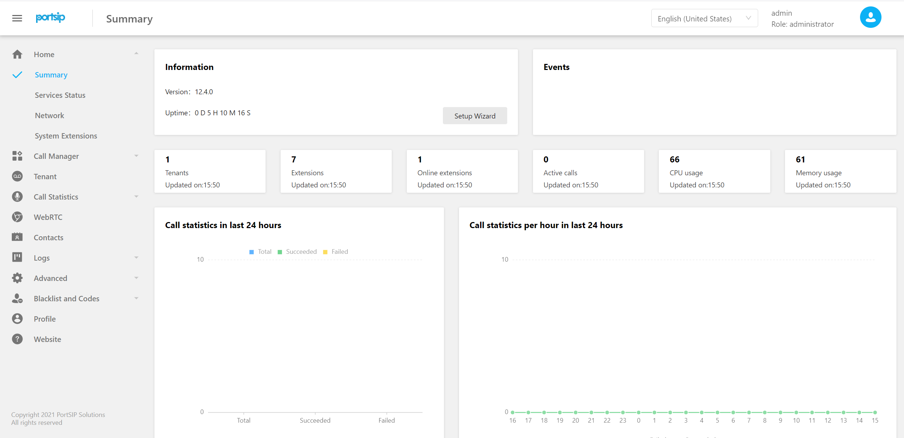
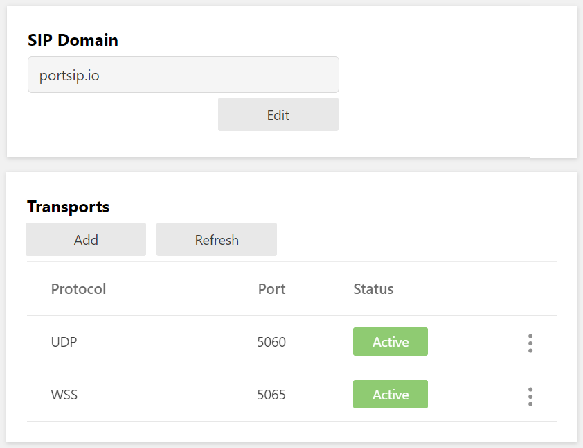

 


# <center>PortSIP PBX 用户手册</center>

版本：v12.5.1

日期：2021 年 5 月 10 日


© 2021 博瞻信息技术有限公司。保留所有权利。未经博瞻信息技术有限责任公司的明确书面许可，不得出于任何目的、以任何形式或任何方式（无论是电子方式还是实体方式）对本手册内容的任何部分进行复制或传播。依据法律，复制包括将内容翻译为其他语言或格式。 


#### 商标

 

PortSIP® 以及与 PortSIP 产品相关的名称和标记均为博瞻信息技术有限公司（以下简称“该公司”或“博瞻信息”）的商标及/或服务标记，是该公司在中国、美国及其他国家或地区的注册及/或普通法商标。其他所有商标均为其各自所有者的资产。未经博瞻信息明确书面许可，不得将此文件的任何部分以任何方式进行复制或转载。


#### 最终用户许可协议
安装、复制或使用此产品即表示您确认您已阅读、理解并同意此产品的 [PortSIP 最终用户许可协议](https://www.portsip.com/portsip-end-user-license-agreement/) 之条款和条件。


#### 专利信息

随附产品受中国、美国和其它国家/地区的一项或多项专利或博瞻信息技术有限公司正在申请的专利所保护。 


#### 免责声明 

由于某些国家或地区、州或省不允许对暗示担保有排除或限制，或不允许对提供给消费者的特定产 品可能导致的任何意外的、连带性的损失有限制，或不允许对人身伤害的责任有限制，因此上述有 关限制或责任排除的规定可能不适用于您。 
当不允许将暗示担保整体排除时，它们将仅限于适用书面担保的期限。该担保赋予您可能随当地法 律而异的特定法律权利。 

© 2021 博瞻信息技术有限公司。保留所有权利。 
博瞻信息 
湖南长沙市岳麓区文轩路麓谷企业广场 C2-903 
未经博瞻信息技术有限责任公司的明确书面许可，不得出于任何目的、以任何形式或任何方式（无 论是电子方式还是机械方式）对本手册内容的任何部分进行复制或传播。依据法律，复制包括将内 容翻译为其他语言或格式。 
就缔约方之间而言，博瞻信息技术有限责任公司保留对其产品所含软件全部所有权的权益和所有权。 该软件受中国版权法、美国版权法和国际条约规定的保护。因此，您必须像对待其他任何具有版权 的资料（如书籍或录音）一样对待该软件。 
我们致力确保本手册上的信息准确。博瞻信息对印刷错误或笔误概不负责。本文档中的信息可予以 更改，恕不另行通知。 


## 第一章  开始使用 PortSIP PBX 

本用户手册将指引管理员将 PortSIP PBX 部署在 Windows 或 Linux 操作系统环境中，并展示了该解决方案的一些部署模式、架构和限制。


### 1.1 什么是 PortSIP PBX

PortSIP PBX（也叫 **PortPBX**、**PortSIP UC Server**）是一个纯软件统一通信系统，支持 Windows 和 Linux 平台。可以 与其他基于 SIP 标准实现的 IP 电话、软件电话、SIP中继以及语音网关等一起组网协作，以比传统硬件 PBX更低廉的价格和更便捷的管理提供完整的通信解决方案。PortSIP PBX 不仅支持所有传统 PBX 的功能，还包含了许多现代通信的功能特性。

PortSIP PBX 不仅仅拥有和传统硬件 PBX 一样的功能，还包括更多新增功能，比如对移动设备 APP和 WebRTC 的支持。PortSIP PBX 统一通信系统不像传统的 PBX 系统一样需要单独的电话线路， 而是直接使用 Internet 或者局域网网络，所有的呼叫都以 IP 数据包的形式在 IP 网络上传输。同时，把 PortSIP PBX 和 VoIP 服务器运营商或者 SIP 中继链接在一起，就可以方便地与 PSTN 网 络电话、手机进行通话。也可以使用 VoIP 服务器运营商而不需要通过网关。PortSIP PBX 具有良好的兼容性，能够和绝大多数厂商基于 SIP 标准的产品一起工作。 


### 1.2 准备工作

#### **Linux 安装先决条件**

将 PortSIP PBX部署在 Linux 的系统环境里，除了需要对 SIP 标准、音视频通话以及 IM 消息有 初步的了解之外，还需要熟悉以下 Linux 相关内容：

**主流 Linux 版本：** 

+ CentOS 7.5以上，8.0 以下版本（64 位）
+ Debian 9 或更高版本（64 位）
+  Ubuntu 16.04 或更高版本（64 位）
+  Docker
+ IPv4/IPv6 
+ Systemd
+ IP tables 
+ Firewalld

本手册假定 Linux 操作系统已经安装并正常运行， PortSIP PBX 管理员拥有 Linux root 权限。


#### **Windows 安装先决条件**

将 PortSIP PBX部署在 Windows 的系统环境里，除了需要对 SIP 标准、音视频通话以及 IM 消 息有初步的了解之外，还需要熟悉以下相关内容：

**Windows 桌面或 Windows Server 操作系统：** 

+ Windows 10（64 位）
+ Windows Server 2012 R2
+ Windows Server 2016 R2
+ IPv4/IPv6 
+ Windows 防火墙

本手册假定 Windows 操作系统已经安装并正常运行，PortSIP PBX 管理员拥有 Windows 系统管理员权限。


#### **支持的云和虚拟环境**

为构建高可用通信解决方案，帮助客户减少成本以及提高通信性能，PortSIP PBX 现已支持云平台，可与以下云平台和虚拟化环境兼容：

+  VMware ESX 5.X 及以上版本
+ Linux HyperV
+  Microsoft HyperV 20012 R2 及以上版本
+  Microsoft AZURE
+  Amazon AWS
+  Google Cloud
+  Digital Ocean
+  UCloud
+  阿里云
+ 腾讯云


**PortSIP PBX 的性能取决于如下几个关键因素：**

+ PBX 系统需要支持多少路并发通话
+ PBX 系统需要支持多少用户同时在
+ 是否对通话进行录音 
+ 仅对音频录音还是录制音视频 
+ PBX 系统需要支持多少人同时进行语音和视频会议
+ PBX 需要支持多少 IVR（Virtual Receptionist）
+ PBX 系统需要支持多少呼叫队列（Call Queue）
+ PBX 系统需要支持多少振铃组（Ring Group）

基于以上几个关键的需求， PortSIP PBX 可以在从 Intel i3 CPU 到 Inter Xeon 多 CPU的各种 PC 机以及服务器上顺畅运行。


#### **其他要求**

+ 最新版本的 Firefox、Google Chrome 
+ Microsoft .NET Framework 版本 4.5 或更高版本
+  了解 Linux 和 Linux 网络管理 
+  熟悉 Windows 和 Windows 网络系统管理 
+  与 stun4.l.google.com 通过端口 19302 的稳定网络连接


#### **域名 (FQDN) 支持**

PortSIP PBX 可以在没有域名的机器上运行，但是我们推荐使用域名。使用域名有如下优势：

+ 可以更方便地访问 PortSIP PBX 的管理控制台
+ 如果安装 PBX 的机器更换了 IP 地址，使用域名可以让你更方便地管理 IP 电话机和客户端 
+ 访问管理控制台和 WebRTC 客户端的时候，可以更方便地启用 HTTPS

使用的域名（FQDN）必须能在局域网里正确地解析到安装了 PortSIP PBX 的机器；如果 PortSIP PBX 安装在 公网上，那么域名必须能正确解析到安装 PBX 的机器的公网地址。 


### 1.3 获取帮助和技术支持 

如果您在安装使用中有任何问题，您可在 [PortSIP 知识库](https://www.portsip.com/knowledge-base/) 找到指南、手册和视频教程，或向 support@portsip.com 发送电子邮件以获得支持。


## 第 2 章 安装 PortSIP® PBX

本章将指导你如何将 PortSIP PBX 安装到 Windows 和 Linux。


### 2.1 下载 PortSIP PBX

您可以从 PortSIP 官网 免费下载最新版本的 PortSIP PBX。PortSIP PBX 分为 Windows 版本 和 Linux 版本，只支持 64 位系统。

免费版的 PortSIP PBX 最大支持 3 路并发通话和最大10个分机注册，无用户（分机）数量限制。如果您需要更多的并发通话数量和注册支持，请参阅 [11.10 许可证](#11.10 许可证) 一节。

下载完成后，您即可获得安装包。 


### 2.2 在 Linux 上安装 PortSIP PBX

> > **自 PortSIP PBX v12 起，PortSIP PBX Linux 版将迁移到 Docker 环境，不再支持 RPM 和 Deb 安装。**


#### **准备 Linux 主机**

安装 PortSIP PBX 前，必须进行如下操作：

+ 如果安装 PBX的 Linux 电脑/服务器位于局域网里，必须分配一个静态的局域网 IP 地 址；如果位于公网，必须得有一个公网静态 IP。 
+ 在安装 PortSIP PBX 之前安装所有可用的系统更新和补丁包。 
+ 不要在 PortSIP PBX Server 上安装 VPN 软件。
+ 不要在 PortSIP PBX Server 上安装 PostgreSQL。
+ 确认已经禁用了系统和网络适配器的省电选项（将系统设置为高性能模式）。 
+ 不要在主机上安装 TeamViewer、VPN 或其他类似软件。 
+ 安装 PortSIP PBX 的主机不能是 DNS 或 DHCP 服务器。 
+ 在防火墙打开如下端口： 
  UDP: 45000– 65000, 25000-  34999
  TCP: 8899– 8900、8887-8888、8881-8885
+ 确保如下端口没有被其他程序占用：
  UDP: 45000– 65000, 25000-  34999
  TCP: 8899– 8900、8887-8888、8881-8885

**重要提示：**如果您是在 AWS，阿里云等云平台上运行 PBX，并且云平台具有自己的防火墙，您还必须在云平台防 火墙上打开这些端口。


#### **在 Linux 上全新安装 PortSIP PBX v12.5.1**

如需全新安装 PortSIP PBX for Linux，请参考：[安装 PortSIP PBX for Linux](http://www.portsip.cn/knowledge-base/setup-portsip-pbx-v12-linux/)


#### **配置 Linux 防火墙规则**

在成功安装了 PortSIP PBX 之后，必须对 Linux 防火墙进行设置，否则 PBX 将无法正常运行。 
如果防火墙拦截了相关端口，必须打开如下端口以使得 PortSIP PBX 正常运行。 

+ UDP 端口：**45000–65000, 25000-34999**。这些端口用于 RTP 传输媒体数据。
+ TCP 端口：**8899– 8900、8887-8888、8881-8885**。这些端口用于服务器控制。
+ UDP：**5060**。这是默认的 UDP 端口，用于传输 SIP 消息，发送和接收 SIP 信令。 
+ TCP：**5065**。默认用于WebRTC 客户端信令传输。

如果以后在 PBX 里面增加了新的 SIP传输协议，同时还需要在防火墙里面打开相对应的端口： 

+ 假如在 5063 端口上增加了 TLS 传输协议，必须在防火墙上打开 TCP 协议的 5063 端口。 
+ 假如在 5061 端口上增加了 TCP 传输协议，必须在防火墙上打开 TCP 协议的 5061 端口。 
+ 假如在 5065 端口上增加了 WS 传输协议，必须在防火墙上打开 TCP 协议的 5065 端口。 
+ 假如在 5067 端口上增加了 WSS 传输协议，必须在防火墙上打开 TCP 协议的 5067 端口。 
+ 假如在 5068 端口上增加了 UDP 传输协议，必须在防火墙上打开 UDP 协议的 5068 端口。 

**重要提示：**如果您是在 AWS，阿里云等云平台上运行 PBX，并且云平台具有自己的防火墙，您还必须在云平台防 火墙上打开这些端口。


### 2.3 在 Windows 系统中安装 PortSIP PBX

#### **准备 Windows 主机**

在安装 PortSIP PBX 前，必须进行如下操作：

+ 如果你要安装PBX的 Windows 电脑/服务器位于局域网里，必须分配一个静态的局域网 IP 地址；如果位于公网，必须得有一个公网静态 IP。
+ 安装所有的 Windows 系统更新和补丁包，在安装更新和服务包的过程中您的电脑可能会重启多次，每次重启后可能要求安装更多的更新。安装期间，需要尤其注意安装所有有关 Microsoft .Net 的更新。完成后即可运行 PortSIP 的安装。 
+ 避免让杀毒软件扫描 *C:\Program Files\PortSIP* 和 *C:\Programdata\PortSIP* 目录，以免导致安装 PortSIP PBX 的过程过长以及写入访问延迟。
+ 不要在 PortSIP PBX 服务器上安装 VPN、TeamViewer 软件。
+ 不要在 PortSIP PBX Server 上安装 PostgreSQL。
+ 确认已经成功启动了 Windows 防火墙服务。
+ 确认已经禁用了系统和网络适配器的省电选项（将系统设置为高性能模式）。 
+ 如果您使用的是 Windows 桌面系统，请禁用蓝牙设备。 
+ PortSIP PBX 不能安装在 DNS 或 DHCP 服务器主机上，也不能与 MS SharePoint 或 Exchange 服务安装在同一台电脑上。
+ 在防火墙打开如下端口：
  UDP: 45000– 65000, 25000-  34999
  TCP: 8899– 8900、8887-8888、8881-8885
+ 确保如下窗口未被其他程序占用：
  UDP: 45000– 65000, 25000-  34999
  TCP: 8899– 8900、8887-8888、8881-8885请确保已启用 Windows 防火墙。


#### **在 Windows 主机上全新安装 PortSIP PBX v12.5.1**

要安装 PortSIP PBX，您只需要双击安装程序文件，然后根据安装程序的提示进行安装。 

PortSIP PBX 的系统服务将在安装成功完成后自动运行，以及在以后每次 Windows 启动后都将自动运行。

**注意，在安装过程中，如果您要更改 PortSIP PBX 的安装目录，如下的两个目录必须不能相同，不能使用同一个目录，否则 PBX 将不能正常工作！**


#### 配置 Windows 防火墙规则

在成功安装了 PortSIP PBX 之后，PortSIP PBX 默认已经将所需要的端口在Windows 防火墙上打开。
如果防火墙拦截了相关端口，必须打开如下端口以使得 PortSIP PBX 正常运行。 

+ UDP 端口：**45000–65000, 25000-34999**。这些端口用于 RTP 传输媒体数据。
+ TCP 端口：**8899– 8900、8887-8888、8881-8885**。这些端口用于服务器控制。
+ UDP：**5060**。这是默认的 UDP 端口，用于传输 SIP 消息，发送和接收 SIP 信令。 
+ TCP：**5065**。默认用于WebRTC 客户端信令传输。

如果以后在 PBX 里面增加了新的 SIP传输协议，同时还需要在防火墙里面打开相对应的端口： 

+ 假如在 5063 端口上增加了 TLS 传输协议，必须在防火墙上打开 TCP 协议的 5063 端口。 
+ 假如在 5061 端口上增加了 TCP 传输协议，必须在防火墙上打开 TCP 协议的 5061 端口。 
+ 假如在 5065 端口上增加了 WS 传输协议，必须在防火墙上打开 TCP 协议的 5065 端口。 
+ 假如在 5067 端口上增加了 WSS 传输协议，必须在防火墙上打开 TCP 协议的 5067 端口。 
+ 假如在 5068 端口上增加了 UDP 传输协议，必须在防火墙上打开 UDP 协议的 5068 端口。 

**重要提示：**如果您是在 AWS，阿里云等云平台上运行 PBX，并且云平台具有自己的防火墙，您还必须在云平台防 火墙上打开这些端口。


### 2.4 准备从 v12.0/v12.1 升级到 v12.5.1

如果您安装的是 Linux 版本的 PortSIP PBX，请忽略本小节。


**从 v12.0/v12.1.0 升级到 v12.3.2**

如果您当前安装的 PortSIP PBX 版本是 v12.0/v12.1.0，那么不能直接升级到 v12.5.1，必须先升级到 v12.3.2版本。请按照  [从 PortSIP PBX v12.0 / v12.1 升级到 v12.3.2](http://www.portsip.cn/knowledge-base/upgrade-portsip-pbx-12-to-13-windows/)进行升级。


**从 v12.2.x/v12.3.0/v12.3.1 升级到 v12.3.2**

如果您当前安装的 PortSIP PBX 版本是 v12.2.x/v12.3.0/v12.3.1，那么不能直接升级到 v12.5.1，必须先升级到 v12.3.2版本。请按照下述步骤进行升级。

1. 下载 v12.3.2 安装包[PortSIP PBX v12.3.2 Windows 安装包](http://www.portsip.cn/downloads/pbx/v12/portsip-pbx-12.3.2.796.exe) 。
2. 双击安装包进行安装。


**当您升级到当前版本到 v12.3.2 后，请继续按照下一小节步骤进行升级。**


### 2.5 升级当前版本到 v12.5.1

#### Windows 升级

1. 进入 **c:/programdata/portsip** 目录, 删除所有以 **.bak** 结束的文件和文件夹。

2. 确认您当前安装的 PortSIP PBX 已经是 **v12.3.2**或者已经升级到 **v12.3.2**，或者你当前安装的版本已经是**v12.4 或者 v12.5**。

3. 下载 v12.5.1 安装包[PortSIP PBX v12.5.1 Windows 安装包](http://www.portsip.cn/downloads/pbx/v12/portsip-pbx-12.5.1.1220.exe) 。

4. 双击安装包进行安装。

   

#### Linux 升级

请执行如下命令进行升级.

> **说明:**
>
> + **IP_ADDRESS** 是指您的 PBX 服务器的IP地址. 在本例中这个地址是 66.175.222.20, 您需要将其改为你的 PBX 服务器地址.
> + **POSTGRES_PASSWORD** 是用来指定 PBX 所用的数据库密码，你可以自行修改。

**CentOS:**

```
$ firewall-cmd --permanent --service=portsip-pbx --add-port=5060/udp --add-port=25000-34999/udp --add-port=5065/tcp --add-port=8885/tcp
$ docker stop -t 120 portsip-pbx
$ docker rm -f portsip-pbx
$ cd /var/lib/portsip
$ sudo rm -rf *.bak
$ docker pull registry.cn-hangzhou.aliyuncs.com/portsip/pbx:12
$ docker container run -d --name portsip-pbx --restart=always --cap-add=SYS_PTRACE --network=host -v /var/lib/portsip:/var/lib/portsip -v /etc/localtime:/etc/localtime:ro -e POSTGRES_PASSWORD="123456" -e POSTGRES_LISTEN_ADDRESSES="*" -e IP_ADDRESS="66.175.222.20" portsip/pbx:12
```


**Debian / Ubuntu**

```
$ ufw allow 5060, 25000:34999/udp
$ ufw allow 8885, 5065/tcp
$ docker stop -t 120 portsip-pbx
$ docker rm -f portsip-pbx
$ cd /var/lib/portsip
$ sudo rm -rf *.bak
$ docker pull registry.cn-hangzhou.aliyuncs.com/portsip/pbx:12
$ docker container run -d --name portsip-pbx --restart=always --cap-add=SYS_PTRACE --network=host -v /var/lib/portsip:/var/lib/portsip -v /etc/localtime:/etc/localtime:ro -e POSTGRES_PASSWORD="123456" -e POSTGRES_LISTEN_ADDRESSES="*" -e IP_ADDRESS="66.175.222.20" portsip/pbx:12
```


### 2.6 使用受信任的证书消除浏览器警告

PortSIP PBX 在 8888 端口监听并提供 HTTP 服务，以便访问 PBX 管理控制台。

假定将 PortSIP PBX 安装在 IP 地址为 172.217.14.16 的服务器上，那么您可以使用 http://172.217.14.16:8888 来访问 PortSIP PBX的WEB 管理界面。注意：推荐使用 Chrome 、 Firefox和最新的 Edge 浏览器，请勿使用 IE 浏览器。

PortSIP PBX 在 8887 端口监听并提供 HTTPS 服务。假定将 PortSIP PBX 安装在 IP 地址为 172.217.14.16 的服务器上，那么您可以使用 https://172.217.14.16:8887 来访问 PortSIP PBX的 WEB 管理界面。注意：推荐使用 Chrome 、Firefox 和 Edge 浏览器，请勿使用 IE 浏览器。

默认情况下，HTTPS 使用自签名的 SSL 证书，将导致浏览器弹出 SSL 证书安全警告信息。 

要避免 SSL 证书警告信息，您需要购买受信任的证书（由受信任的证书机构发放的授权证书），替 换自签名证书。要执行该操作，请遵循以下步骤： 

- 将您要使用的 **PBX Web domain** 解析到您的 PBX 服务器IP。

- 联系 Thawte、Digicent 或者 Versign 等证书提供商，购买 SSL 证书，将私有密钥保存为 **portsip.key**。

- 在获取到 SSL 证书后，将其重命名为 **portsip.crt**。 

- 将上述证书文件保存好，我们将在后面使用。

  


注意：您还可以从 [Let’s Encrypt](https://letsencrypt.org/) 免费获取受信任的 SSL 证书。


## 第 3 章 配置部署 PortSIP® PBX

------

PortSIP PBX 包含多个组件，例如 Call Manager、Media Server、REST API Gateway、File Server、Database、Call Queue、Conference、Voicemail、MOH、Auto Attendant、Instant Messaging 以及 Presence Server。以下是其架构工作原理示意图。


PortSIP PBX 支持多种方式部署以适应不同的应用场景。支持在局域网或者 Internet 上的部署， 支持各种虚拟化平台，支持多种主流云平台比如 AZURE、AWS、GCE、阿里云、UCloud、Linode， Digital Ocean、腾讯云、华为云等。 
PortSIP PBX 成功安装后，只需要简单地点击几下鼠标就能够完成必要的设置，让 PortSIP PBX 正常运行。


#### 运行 PortSIP PBX 设置向导

PortSIP PBX 提供的设置向导将指引你完成几项必须的设置，让系统运行起来。 
PortSIP PBX 监听 8888 端口并提供 HTTP 服务，并监听 8887 端口以提供 HTTPS 服务。

- 在浏览器中打开 http://mypbx:8888，访问 PortSIP PBX 管理控制台（请勿使用 IE 浏览器）。
- 输入管理员用户名和密码（默认为 **admin/admin**），然后点击“**登录**”按钮。注意：用户名和密码均区分大小写，请注意核对。输入正确的用户名和密码并成功登录之后，系统将会自动弹出配置向导，您只需要根据向导的指引逐步完成配置。 

如果要修改 **admin** 的默认密码，请在登录管理控制台之后，点击左侧菜单“**用户资料** > **常规**” 进行修改。 


### 3.1 在局域网里部署 PortSIP PBX 

假定我们需要将 PortSIP PBX 部署在局域网中，整个局域网通过 Internet 连接，安装 PortSIP PBX 的服务器私有 IP 地址是 192.168.0.16。同时在 PBX 里配置了 VoIP 运营商或者 SIP 中继，使得局域网里注册到 PBX 系统上的的分机用户不仅可以互相呼叫，还能通过预先配置的 VoIP 运营商或者 SIP 中继与传统 PSTN 网络里的固定电话和手机进行呼叫通话。 


**第 1 步：**

要使用 HTTPS 访问 PBX 管理界面和 WebRTC 客户端功能，您必须设置在这一步设置 "**Web Domain**" , 准备好这个 "**Web Domain**" 的 SSL 证书文件， 因为浏览器要求受信任的 SSL 证书否则会提示安全警告，并阻止使用 WebRTC 客户端。详情见前面 [2.6 使用受信任的证书消除浏览器警告。](#2.6 使用受信任的证书消除浏览器警告)

如果您的PBX服务器拥有的**静态公网 IP 地址**，请将其输入到Public IPv4。如果您的公网 IP 地址是动态 IP，请勿在Public IPv4 内输入信息。

**请注意，不能输入127.0.0.1。**必须输入 PBX 所在服务器的正确局域网静态 IP（不能使 DHCP 动态 IP）。必须确保你的 IP Phone 或者其他的 SIP 客户端与 PBX 服务器之间的网络通畅。

此处输入的 IP 地址就是 PBX 的 SIP 服务器地址，在 SIP 客户端或者 SIP IP Phone 注册到 PortSIP PBX 的时候，需要将其作为 Outbound Porxy (出站代理) 输入。 


**第 2 步：** 

现在输入要使用的 SIP 域名，它通常是完全限定域名（FQDN）。如果没有 FQDN，也可以使用 PBX 服务器的 IP 地址来做为 SIP 域名。SIP 域名仅用作 SIP 消息认证，不要求必须能解析。

设置 SIP 域名之后，所有的分机用户的 SIP 账号地址都是如下形式：xxx@portsip.io。例如，分机 101 的 SIP 地址将是 sip:101@portsip.io。如果您不希望使用域名，请输入安装了 PortSIP PBX 的计算机/服务器的私有 IP（例如 192.168.0.16 ），用于替代域名 (FQDN) 。在此情况下，分机 101 的 SIP 地址就是 sip:101@192.168.0.16。


**第 3 步：**

 在此设置 SIP 消息的传输协议。系统默认设置 SIP 传输协议是 UDP 协议，绑定监听在 5060 端口。
**注意：**如需设置更多的 SIP 传输协议，可以在向导完成进入管理控制台后进行。 


**第4步:**

要使用 HTTPS 访问 PBX 管理界面和 WebRTC 客户端功能，您必须在向导的第一步设置 "**Web Domain**" , 并在本步骤上传准备好的 SSL 证书文件给 WSS 传输协议。 默认情况下，PortSIP PBX 使用 5065 端口为 WebRTC 客户端提供服务。详情见前面 [2.6 使用受信任的证书消除浏览器警告](#2.6 使用受信任的证书消除浏览器警告)


**第 5 步：** 

设置邮箱服务器。用户可以在该步骤设置电子邮件服务器，用于接收系统通知、语音信息、会议邀请及下载的文件等。PortSIP PBX 支持用户的 SMTP 服务器比如Gmail SMTP 或者腾讯SMTP 服务器。

**注意：**该步不是必填项，您可以根据需要进行设置。您可随时选择设置 SMTP 服务器。 
点击“**保存**”按钮，就完成了 PortSIP PBX 的基本设置。然后，系统会自动跳转到管理控制台界面。


**第 6 步：** 

在成功完成设置向导之后，您需要重启 PortSIP PBX 使得 SSL 证书生效。

**Linux:** 

```
$ sudo docker exec -it portsip-pbx /bin/bash
$ supervisorctl stop nginx
$ supervisorctl stop gateway
$ supervisorctl start nginx
$ supervisorctl start gateway
```

**Windows:**

```
直接重启 Windows 服务器。
```

+ 现在您可以使用 https://mypbx.com:8887 来访问您的 PBX 管理界面。

如果您使用的是自签名证书，那么浏览器会弹出警告并阻止您的访问，详情见前面 [2.6 使用受信任的证书消除浏览器警告](#2.6 使用受信任的证书消除浏览器警告)


### 3.2 在云平台部署 PortSIP PBX

PortSIP PBX 可部署在 AWS、GCE、AZURE、Digital Ocean、阿里云、UCloud、华为云、腾讯云等主流云平台。

在该节中，我们将以 AWS 为例，其他云平台部署方式与 AWS 基本相同。

将 PortSIP PBX 部署在 AWS 上，分机用户可以通过 internet 上的 PortSIP PBX 进行呼叫通信， 并通过配置的 VoIP 运营商或者和 SIP 中继与传统 PSTN 网络上的固定电话、手机进行呼叫通 话。

如果你还没有亚马逊的 AWS 账号，请阅读 [Creating an AWS account](https://aws.amazon.com/premiumsupport/knowledge-center/create-and-activate-aws-account/)，并创建一个 AWS 账号。您还需求启动一个 EC2 实例，用于安装 PortSIP PBX。


**第 1 步：** 

在 AWS 的 EC2 管理界面左边的菜单里，选择“**弹性 IP 地址**”（**Elastic IP**），请将它记录下来供后面使用。如果没有看到**“Elastic IP****”，请点击左边的菜单列表里的“**分配新地址**”（**Allocate New Address**） 来向 EC2 实例分配一个弹性 IP。 


**第 2 步：**

在 PortSIP PBX 配置向导中，在“**私有 IPv4**”中输入 AWS EC2 的私有 IP 地址，在“**公共 IPv4**”中输入 AWS EC2 的“**Elastic IP **”。

剩余步骤和“[3.1 在局域网里部署 PortSIP PBX](#3.1 在局域网里部署 PortSIP PBX)”相同。


### 3.3 在其他应用场景安装部署 PortSIP PBX 

如果要在上述没有提及的场景部署 PortSIP PBX，只需要获取服务器 IP 地址（公网 IP 和私网 IP），将其输入 PBX 设置向导，然后使用配置向导进行部署。 

**注意：**如果服务器只有公网 IP 地址，没有私有 IP 地址，请在“**公共 IPv4**”“**私有 IPv4**”中均输入该公网 IP 地址。


## 第 4 章 PortSIP PBX 概览

跟随配置向导的指引完成初始配置之后，接下来就可以在管理控制台里面对 PortSIP PBX 进行配 置管理。 


### 4.1 首页





在此页面中，我们可查看 PBX 统计信息概要：

- 版本
- 运行时间
- 事件
- 分机
- 租户
- 当前通话
- CPU 和内存用量
- 过去 24 小时的通话统计数据


### 4.2 服务状态


您可前往 PortSIP PBX 系统管理控制台的“**首页 > 服务器状态**”菜单，简要查看 PortSIP PBX 系统服务是否都运行正常。


### 4.3 网络

该部分概述了 PBX 的基本网络配置，包括 DNS 服务器、PBX IP、SIP 域名、Transport 等信息。这些设置对于将 SIP 客户端注册到 PBX 非常有用。


### 4.4 系统分机

PortSIP PBX 将 PBX 所使用的虚拟接待、会议、振铃组、呼叫队列、语音邮箱、Music On Hold 等服务定义为系统分机，这些系统分机号码只能被 PBX 本身所使用。您可以在“**首页**> **系统分机**”中查看各项系统服务是否正常注册到了 PBX。 


## 第 5 章 通话管理

完成配置向导后，您即可在管理控制台管理 PortSIP PBX。


### 5.1 域名和传输协议

在 PBX 里设置 SIP 域名之后，SIP 客户端注册到 PBX 时和呼叫时所使用的 SIP 地址里的域名必须和 PBX 里设置的 SIP 域名相同。同时，当其他分机用户呼叫你的时候，也必须使用 SIP 域名做为你的 SIP 地址的一部分，否则你将无法收到呼叫。SIP 域名可以是一个 FQDN，也可以是一 个 IP 地址。比如 **portsip.io** 或者 **192.168.0.16**。

SIP 域名是在您第一次登录管理控制台时显示的 PBX 配置向导第二步设置的。如需修改 SIP 域名，请点击管理控制台左侧的菜单“**通话管理 > 域名和传输协议**”。然后点击“编辑”按钮输入新的 SIP 域名并保存。  





PortSIP PBX 支持所有的主流传输协议来收发 SIP 消息，包括 UDP、TCP、TLS、WS (WebSocket) 和 WSS (WebSocket Security)。您必须设置配置传输协议，以便 PBX 正常接收和发送来自客户端的 SIP 消息。 

默认的传输协议是在你第一次登录管理控制台时显示的 PBX 配置向导的第三步设置的。如果你要修改传输协议，请点击管理控制台左侧的菜单“**通话管理 > 域名和传输协议**”，然后在“**传输协议**”部分点击“**新增**”按钮。在增加新的传输协议之前，您必须先成功设置 SIP 域名。 

**注意：**SIP 传输协议只有 admin 用户才有权创建和删除，并且需要保留至少一个传输协议。 


#### **增加 UDP/TCP/WS 传输协议 **

增加 UDP/TCP/WS 传输协议的步骤如下： 

- 点击“**添加**”按钮，然后在“**传输协议**”的窗口里，在协议的下拉框里选择 UDP、TCP 或者 WS，UDP/TCP/WS 传输协议的默认端口分别为 5060/5063/5062，你也可以使用其他的端口。你需要确保你所使用的端口没有被其他程序所占用。 
- 点击“**确定**”按钮即可成功增加新的传输协议。 


#### **增加 TLS/WSS 协议**

增加自签名证书的 TLS/WSS 传输协议之前，具体步骤如下： 
在增加 TLS/WSS 传输协议的时候，必须提供相关的 SSL 证书。

- 如果没有从受信任的第三方证书机构购买证书，那么你需要生成自签名证书。请从博瞻信息的网站下载证书生成工具并运行（或者运行 PBX 安装目录下的 *PortCertMaker.exe*），输入公司名称（英文或者拼音），以及 PBX 的 SIP 域名，然后点击“**生成**”按钮，证书工具将生成自签名证书。

- 生成的证书包括如下三个文件（假设您的 Web Domain 是 mypbx.com）：
  
  domain_key_mypbx.com.pem

​       domain_cert_mypbx.com.pem

​        root_cert_mypbx.com.pem

  将 domain_key_mypbx.com.pem 重命名为 portsip.key，将 domain_cert_mypbx.com.pem 重命名为 portsip.crt.

  

如果你需要从受信任的第三方证书证书提供商处购买证书，那么请按照如下步骤（假设为 mypbx.com 购买证书）： 

  - 根据证书提供商的指示生成 CSR 文件和私有证书文件并保存。如果你在生成私有证书 的时候设置了密码，请记录下来。

  - 将私有证书文件重命名为 portsip.key。

  - 将 CSR 提交给证书提供商，在你的证书申请被通过之后，请从证书提供商处下载你的证书文件，证书文件通常有两个：Intermediate CA 证书 和 SSL 证书。

  - 用一个纯文本编辑器（不能用WORD）分别打开 Intermediate CA 证书 和 SSL 证书， 然后将 Intermediate CA 证书的全部内容复制后粘贴在 SSL 证书内容的后面，将合并后 的 SSL 证书文件另存为 portsip.crt。
  
- 点击“**添加**”按钮，然后在“**传输协议**”窗口，在协议下拉框里选择 TLS 或者 WSS， TLS/WSS 传输协议的默认端口分别为 5063/5065。您也可以使用其他的端口，需要确保您所使用的端口没有被其他程序所占用。 

- 点击证书文件后面的“**上传**”按钮选择域名证书文件： 为“**证书文件**”选择 “portsip.crt”，为“**私钥文件**”选择 “*portsip.key*”。

- 点击“**确定**”按钮，完成设置。 

  

> **重要提示：创建完 TLS/WSS 传输协议之后，请执行如下操作对服务器进行重启以使得 SSL 证书生效。**

**Linux:** 

```
$ sudo docker exec -it portsip-pbx /bin/bash
$ supervisorctl stop nginx
$ supervisorctl stop gateway
$ supervisorctl start nginx
$ supervisorctl start gateway
```

**Windows:**

1. 重启 Windows 服务器。


现在您可以使用 https://mypbx.com:8887 来访问您的 PBX 管理界面。

如果您使用的是自签名证书，那么浏览器会弹出警告并阻止您的访问，详情见前面 [2.6 使用受信任的证书消除浏览器警告](#2.6 使用受信任的证书消除浏览器警告)。


#### **为新添加的传输协议设置防火墙 **

在成功添加新的传输协议之后，必须更改防火墙规则来允许新增的传输协议进行网络通信。假设在 PortSIP PBX 里面增加了如下的传输协议： 
UDP：5060
TCP：5061
TLS：5063
WS：5064
WSS：5065

那么必须在防火墙规则里允许如下协议和端口： 
UDP：5060 from IP: 0.0.0.0(anywhere)
TCP：5061 from IP: 0.0.0.0(anywhere)
TLS：5063 from IP: 0.0.0.0(anywhere)
TCP：5064 from IP: 0.0.0.0(anywhere)
TCP：5065 from IP: 0.0.0.0(anywhere)


### 5.2 话机

#### 话机自动配置 

PortSIP PBX 系统安装完成后，您可以配置您的 IP 话机，为每台话机分配一个分机号。 

您可以选择通过话机网络页面手动逐个配置，该方法花费时间较多，且容易出错；此外您还可以使用 PortSIP PBX 提供的话机配置功能，集中远程管理话机，无须逐个登录话机的网络页面。使用话机配置功能，您可以允许话机从 PortSIP PBX 检索配置。

话机配置可从 PortSIP PBX 管理控制台集中执行更改分机密码、BLF等操作，并将更改推送到所有话机，极大地简化了 IP 话机的日常管理。支持以下配置方法：

- **即插即用** – 支持的 IP 话机可使用即插即用功能，自动配置（适用于本地局域网的话机） 
- **通过手动配置 URL** – 可将配置 URL 输入至话机的 web 页面，以此配置支持的 IP 话机 （适用于本地、远程和 SBC 分机） 
- 通过 DHCP 选项 66 – 旧有话机（从先前 PBX 安装版本配置，例如 Polycom、Cisco 或 Aastra）可通过 DHCP 配置，仅限在本地局域网使用。存在部分限制。 

您可在此处查看支持的话机列表。只需多花半个小时配置话机，为未来节省无数精力！ 


#### **使用即插即用功能配置话机（本地局域网）** 


**注意**：即插即用配置要求 PortSIP PBX 在默认 SIP 端口 5060 上运行，并且 IP 话机位于 PortSIP 所在的同一本地局域网子网。 

要使用即插即用功能自动配置话机： 

1. 将话机插入至网络。
2. 话机将在局域网络发送一条广播传播信息。该信息将由 PortSIP PBX 收到。
3. 话机作为新话机显示在 PortSIP PBX 管理控制台的“**通话管理** > **话机**”页签。 
4. 将话机指定给现有分机，或为其新建分机。 
5. 转至分机的“**话机配置**”标签页，为话机指定其他配置设置。 
6. 输入用于访问 IP 话机 Web UI 的密码。
7. 为话机选择“**话机显示语言**”和“**时区**”。
8. 单击“**确定**”。
9. 系统将向话机发送一条配置文件的链接，IP 话机将下载该配置文件。
10. 话机将应用这些设置，然后连接至 PortSIP PBX。现在您可以从 PortSIP PBX 管理控制台管理 IP 话机。 


#### **使用话机配置链接手动配置话机 **

未与 PortSIP PBX 位于同一局域网的远程话机必须通过话机配置链接进行配置。要配置远程话机： 

1. 在 PortSIP PBX 管理控制台的“**通话管理** > **话机**”菜单选择“**添加话机**”。 
2. 选择话机所要使用的分机。 
3. 输入话机的 Mac 地址，可在话机底部找到。 
4. 从下拉菜单选择对应的话机型号。 
5. 为话机选择“**话机显示语言**”和“**时区**”。 
6. 输入用于访问 IP 话机 Web UI 的密码。
7. 点击“**保存**”按钮，然后编辑此分机。
8. 复制配置链接。
9. 将配置链接手动插入话机，链接可在分机配置的“**话机配置**”页签找到。 


#### **通过 RPS 配置远程话机**


如果 PortSIP PBX 安装在云环境，可通过 RPS（RPS 是由 IP 话机供应商提供的服务）自动配置 IP 话机。PortSIP PBX 支持 Yealink（亿联）、Htek（汉隆）和 Fanvil RPS（方位）。如果您使用了上述供应商生产的 IP 话机，则可轻松配置话机，无需手动复制配置链接（在此场景下，PnP 模式不可用）。

1. 在 PortSIP PBX 管理控制台的“**通话管理** > **话机**”菜单，选择“**添加话机**”。
2. 选择话机所要使用的分机。 
3. 输入话机的 Mac 地址，可在话机底部找到。 
4. 从下拉菜单选择对应的话机型号。 
5. 为话机选择“**话机显示语言**”和“**时区**”。 
6. 输入用于访问 IP 话机 Web UI 的密码。
7. 点击“**确定**”按钮，PortSIP PBX 随即将配置链接写入至 IP 话机的 RPS。IP 话机启动后，它会使用其 MAC 地址查询配置链接，完成自动配置。


#### **配置旧话机：Cisco、Polycom 和 Aastra **


Cisco、Polycom 和 Aastra 话机使用 Let’s encrypt Root CA 证书或自签名证书，不支持即插即用 或安全 HTTPS 配置。他们仅可在本地局域网上使用，必须按以下方式进行配置： 

1. 下载已经由博瞻信息使用旧有话机测试过的固件。  
2. 将话机恢复出厂设置，确保没有可能与新配置冲突的旧设置。请参考话机的用户手册了解更 多信息。在此查看如何为 Aastra、Cisco、Cisco SPA 和 Polycom SoundPoint / SoundStation 恢复出厂设置。
3. 现在将话机添加到分机。您可以从管理控制台的话机界面执行该操作，或直接转至分机的话 机配置页签，点击“**添加话机**”。 
4. 选择话机型号。
5. 输入话机 Mac 地址，您将转至话机配置页面。
6. 为话机选择“**话机显示语言**”和“**时区**”。
7. 输入用于访问 IP 话机 Web UI 的密码。
8. 单击“**确定**”以将话机添加到分机。
9. 注意：请记录下“**自动话机配置**”页签的配置链接。 

现在配置话机，从 PortSIP 配置文件夹检索配置。使用 DHCP 选项 66 或通过话机的网页界面使用 PortSIP 配置链接手动配置话机。Cisco 7940/7960 必须使用 TETP 和 DHCP 选项 66 进行配置。


旧版话机逐步设置指南： 

[配置 Polycom IP 话机](https://www.portsip.com/provisioning-polycom) 

[配置 Cisco 7940/ 7941/ 7960 /7961 话机](https://www.portsip.com/provisioning-cisco-79xx) 

[配置 Cisco SPA 302、303、501G、502G、504G、508G、509G、525G/G2](https://www.portsip.com/provisioning-cisco-spa) 

[配置 Aastra 6730i、6731i、6739i、6751i、6753i、6755i、6757i](https://www.portsip.com/provisioning-aastra-67series/)


#### **其他参考**

正在使用远程话机？请阅读[配置远程话机指南。](https://www.portsip.com/provioning-remote-extension)

 使用[通过 DHCP 66 配置 IP 话机](https://www.portsip.com/provisioning-phone-dhcp66/)，为旧版话机配置话机配置 URL。

查看 PortSIP PBX [支持的 IP 话机](https://www.portsip.com/portsip-pbx-supported-phones) 列表。

[设置 TFTP 服务器](https://www.portsip.com/setup-tftp-server)以进行固件升级。

为 Aastra、Cisco、Cisco SPA、Gigaset、Panasonic、Polycom SoundPoint、Polycom Soundstation、Yealink [恢复出厂设置](https://www.portsip.com/factory-reset-ip-phone)。

[PnP 自动配置 IP 话机多播调试](https://www.portsip.com/pnp-auto-provision-ip-phone-multicast-debug/)


## 5.3 话机管理 

PortSIP PBX 可让您通过网络轻松监测和管理话机和软电话。通过 PortSIP PBX 管理控制台的“**通话管理**“>”**话机**”页签，您可以执行以下操作：

- 查看网络中的所有话机，包括 IP 和 MAC 网络。

- 查看连接的所有处于软电话模式的 PortSIP 客户端。 

- 检查话机运行的固件版本。

- 远程重启一台或多台话机。 

- 重新配置话机。

- 启动话机管理界面。

- 监测分机密码和 PIN 码。分机密码和 PIN 码太弱可能导致大部分安全漏洞。

  

#### 添加话机

您可以通过以下方式向 PortSIP PBX 添加话机： 

- 即插即用 – 插入本地局域网的话
- 通过 MAC 添加 – 用于旧话机 
- 通过 RPS 添加 - 用于远程话机


#### 即插即用（局域网和 SBC）

如果连接的话机和 PortSIP PBX 位于同一局域网内，您将看到该话机出现在话机页面上，且其名 称显示为粗体。这表示 PortSIP PBX 在网络上检测到了新的话机，您需要进行处理。 

选择话机，并决定如下操作： 

1. 将话机指定给现有分机。单击“**指定分机**”。系统将提示您分机号码。
2. 为话机创建现有分机。单击“**添加分机**”按钮。您将被指向创建分机页面，系统将提示您填写分机名和号码。单击“**确定**”创建分机。 
3. 拒绝话机。如果话机看起来比较陌生，或其尚未授权供 PortSIP PBX 使用，您可以“**拒绝**”以删除话机配置请求。


#### 通过 MAC 添加 – 用于旧话机

您可以通过以下方式，添加不支持即插即用的老旧话机： 

1. 在“**话机**”页签单击“添加话机”按钮。 
2. 选择要应用此话机的分机。
3. 选择话机型号。
4. 输入设备 MAC 地址，然后单击“**确定**”。
5. 您将跳转到分机的话机配置页面。
6. 您还可以选择为话机配置其他设置。 
7. 完成后，单击“**保存**”以将话机添加至分机。 
8. 配置 DHCP 服务器以供配置 URL 使用，或从话机 Web 界面配置 URL。 


#### 通过 RPS 配置远程话机

如果您需要添加远程安装的话机，也即位于远程网络的话机，您必须执行以下操作：

1. 在“**话机**”页签单击“**添加话机**”按钮。 
2. 选择要应用此话机的分机。 
3. 选择话机型号。
4. 输入设备 MAC 地址，然后单击“**确定**”。 
5. 您还可以选择为话机配置其他设置。 
6. 完成后，单击“**保存**”以将话机添加至分机。
7. 现在，PortSIP PBX 会将配置链接写入 IP 话机 RPS。IP 话机启动后，它即会从 RPS 获取链接，从 PortSIP PBX 下载配置文件。请注意：当前 PortSIP PBX 仅支持 Yealink（亿联）、Fanvil（方位）和 Htek（汉隆）的 RPS。如果您的话机不是由以上三家厂商提供的，请参考第 8 步。
8. 手动复制配置链接，将其插入至 IP 话机。


#### 访问话机 UI

PortSIP PBX 让您能够轻松访问已配置话机的使用密码保护的 Web 界面。PortSIP PBX 会为其配 置用户名和独特密码，并管理您的凭证。要访问话机 UI，请执行以下操作：

- 选择话机，然后单击“**话机 UI**”。 
- 对于大部分话机，您将自定跳转至话机 UI 页面。 
- 对于部分老旧话机，您可能需要输入话机的密码。在此情况下，单击“**密码**”按钮以显示 密码，并复制密码为该话机配置的密码，将其粘贴到话机认证页面。 


#### 更改话机设置

通过“**话机**”部分“**通用**”页签或“**设置**”部分的“**话机自动配置**”页签对某话机的话机配置进 行的更改将于 24 小时内生性。您可以重新配置话机以使其马上应用新的配置。如果您需要重新配 置话机，例如在您进行配置更改后，请执行如下操作： 

1. 选择要重新配置的话机。 
2. 单击“**重新配置**”。 
3. 如果需要重启话机，将会自动执行。此后无需再次重启话机。 


## 5.4 分机用户管理 

本节指导您如何在 PortSIP PBX 的管理控制台里创建以及管理分机用户。PortSIP PBX 支持以多 种方式创建分机用户： 

● 配置新话机时，可以选择创建一个新的分机用户。
● 在“通话管理 > 分机用户”菜单里点击“新建分机用户”手动创建一个分机用户。
● 可以从 CSV 文件批量导入分机用户，其中包含 DID 等参数信息。
● 通过调用 REST API 创建分机。


在 PBX 管理控制台里，点击左边的“通话管理 > 分机用户”，然后点击“新建分机用户”就 可以创建新的分机，或者选中已有的分机用户，单击右边的“编辑”图标可以对已经存在的分机 用户进行配置管理。其中“Web访问密码”在分机用户登录WEB管理控制台的时候使用。 


#### 常规

在“**常规**”选项卡，可以输入要创建的分机号码、密码、用户名字、姓氏、以及电子邮箱地址。分机号码可以是数字也可以是密码，其中分机号码和密码是必填项。成功创建分机用户后，PBX 系统将会自动发送一封欢迎邮件到分机用户的邮箱，后续还会向其发送语音邮件和未接来电通知（可配置）。

字段“**Web 访问密码**”用于供分机用户登录到管理控制台。 

如果配置了 SMTP 服务器，成功创建分机并设置了电子邮箱，PortSIP PBX 会向分机用户的电子邮箱发送一封电子邮件，其中包括了其分机信息和 PBX SIP 域名、PBX IP 以及二维码等信息。用户可使用 PortSIP UC 应用扫描该二维码，无需输入这些详细信息即可登录到 PBX。

这里有分机号码登录信息的二维码，您可以使用 PortSIP App 扫描该二维码，自动登录到 PortSIP PBX，而不用手动输入账号信息。

您输入的电子邮箱必须是唯一的，自 PortSIP PBX v12 起，不再允许使用重复的电子邮箱。用户可使用分机电子邮箱登录到 PortSIP PBX 管理控制台。

在 DID 部分，您可以为分机号码设置一个 DID 号码，而不需要为这个分机号码额外创建一条接入规则。

"例**外规则**" - 根据主叫者号码和不同的时间段来创建例外规则，从而可以跳过分机号码的路由转发规则。


#### 语音邮件 

在“**语音信箱**”选项卡里，可以设置分机用户的语音邮件选项，包括收听语音邮件时候的密码， 启用或者禁用语音邮件，启用或者禁用收到语音邮件时候的认证，以及是否让 PortSIP PBX 系统 在你收听语音邮件的时候播放呼叫者的ID、分机号码以及时间和日期。

在分机用户创建成功之后，可以在“**语音信箱**”选项卡的“**语音信箱问候语**”部分对语音信箱的问候语音文件进行管理。

点击“**浏览**”按钮以上传新的问候语文件。上传成功后，点击锁定图标来将文件指定为语音信箱的问候语。


#### 呼叫转发规则 

每一个分机用户都可以设置一系列的来电转发规则让 PortSIP PBX 在分机用户无法接听的时候， 按照设置的规则来转发呼叫。这些转移规则基于如下几个因素： 

- 分机用户当前的状态，比如在线或者离线、忙碌或离开。 
- 当前的时间 

对于分机用户的每一个状态都可以设置一个来电转移规则。例如，如果分机当前状态是在线，但是忙碌，那么可以将这个呼叫转发给语音邮箱（前提是已启用“**语音邮箱**”）或者手机号码。

**注意，将呼叫转移到手机等外部号码需要配置相应的 VoIP运营商/SIP 中继，并设置相应的外拨规则。** 


#### 选项

在“**选项**”选项卡里，可以设置或者限制分机用户的一些功能。 

- 外呼方主叫方 ID –  可以在这里设置分机用户的外呼主叫 ID，这样在该分机用户通过某个运营商 /SIP 中继进行外呼通话后，可以指定用外呼主 ID 来替代某个指定的 SIP 字段，详情请查阅第 5.6 节中的“[配置 VoIP 运营商/SIP 中继](配置 VoIP 运营商/SIP 中继)”。
- 外部紧急通话主叫方 ID – 可在此为分机输入外部紧急通话主叫方 ID，当分机通过特定提供商/SIP 中继发起紧急外部通话时，可使用该 ID 替代特定的 SIP 字段。如需了解详情，请参考第 5.6 节中的“[配置 VoIP 运营商/SIP 中继](配置 VoIP 运营商/SIP 中继)”。。
- 通话录音 – 如果选中了该选项，这个分机用户的所有通话都将被录制为 .wav 文件。 
- 视频录制  – 如果选中了该选项，该分机用户的所有视频通话都将录制为 AVI 文件。 
- 已启用 – 如果未选中该选项，分机用户将被禁用。 
- 允许使用传呼/对讲功能 – 如果选中了该选项，分机用户可以发起传呼/对讲。该选项是从“分机组”继承而来，无法更改。
- 允许呼叫外部号码 –  如果选中了该选项，分机用户可以通过已经配置的 VoIP 运营商/SIP 中继 呼叫外部号码（包括手机和固定电话）。
- 允许登录管理控制台 – 如果选中了该选项，分机用户可以登录到 PBX 的管理控制台。 
- 所属群组 - 它显示该分机所属的分机组。


#### 工作时间

工作时间功能允许指定分机用户的上班时间，分机用户可以根据工作时间来设置相应的来电转移 规则以将来电转移给不同的号码。
可以选择让分机用户使用 PBX 的全局上班时间设置，也可以选择让分机用使用自己定义的上班时 间。点击选择使用指定的上班时间后，在下面的输入框里选好时间并点击向左或向右按钮来设置。 设置完成后，点击“确定”按钮以使设置生效。 


#### 话机配置

您可以通过“**话机配置**”页签为此分机添加话机或编辑其话机设置。可在“**话机配置**”查看如何管理 IP 话机设置。 


#### BLF

您可在此页签为 IP 话机配置 BLF 灯。

将分机与 BLF 按钮匹配，以使该按钮显示分机状态。各话 机的可用 BLF 按钮数可能不同。 

BLF 提供以下可用选项： 

- BLF – 显示其他分机用户的在线状态。 
- 快速拨号 – 链接到一个电话号码，让您轻松快捷发起呼叫。 
- 自定义快速拨号。 
- 更改状态。 


#### 计费

管理员/租户可以为分机用户设置余额。在启用计费的情况下，余额不足会导致通话失败（请参阅第 [5.13](#5.13 计费) 节）。 


#### 个人资料 

在用户资料的选项卡里，可以设置分机用户的个人资料。其中公司名和公司网址是不能修改的， 所有由 admin 用户创建的分机用户的公司名和公司网址都沿用 admin 的公司名和公司网址。 


## 5.5 分机组

在通话管理下的“**分机组**”菜单里，可以对分机用户进行分组管理，通过分机组区分用户和管理员，并确定要对各分机显示何种信息。

PortSIP PBX 系统有一个默认组，通常命名为 **Default**，默 认组不能被删除和修改。 

请注意：每一个分机用户至少属于一个组。当一个分机用户被创建之后，自动归属于系统默认组。

分机用户可以在加入某个分机组之后被赋予各种权限，PortSIP PBX 对分机用户的权限管理是基 于分机组来进行的。当某个分机组被赋予某项权限之后，这个分机组的所有组员自动拥有该项权 限。分机用户加入某个分机组后，可以查看组内其他成员的信息，分机组管理员的权限高于组内其他分机用户的权限。系统会根据组成员关系分配权限，群管理员可以查看其组内任何成员的呼 叫详细信息，包括接入及外拨呼叫。


#### 创建分机组 

在管理控制台左边的菜单，选择“**通话管理** > **分机组**”菜单，然后点击“新增”。在组信息选项卡输入组名以及描述信息，并选择需要设置的组权限。 

点击**组成员**选项卡，您可以将已存在的分机用户添加进分机组，然后点击**确定**按钮，分机组随即创建。 

当一个分机组被授予“**允许访问管理控制台**”权限后，所有的属于这个分机组的分机用户都可以登录 PortSIP PBX 管理控制台。假如 101 分机用户密码是 101，admin 在 PBX 系统设置的 SIP 域名是 portsip.io，101 分机用户属于系统默认组，该组被赋予了系统管理控制台的登录权限，那么 101 分机用户可以以如下方式登录：

- 选择“使用分机号码登录”
- 分机号码：101
- 分机 Web 密码：在此情况下，分机 101 的 Web 密码是 111111
- SIP 域名：portsip.io

分机用户可以同时属于不同的用户组，并拥有这些分机组权限的合集。 


分机组有一个“**监听**”页面，用于设置分机用户通话监听权限。在这里，可以将一个或者多个分机用户设置为监听成员，并勾选上“**允许成员拥有监听权限**”，然后点击“**确定**”按钮，这样这些成员即可对其他分机用户的通话进行监听，或者密码、强插、强拆。更详细的说明请见 [CTI功能](#11.3 CTI功能)。


## 5.6 运营商/中继

VoIP 运营商通过 IP 传送语音，取代了传统电话网。VoIP 运营商可以在一个或多个城市分配 本地号码，并将其传送至电话系统，并且大多支持号码转携。 

VoIP 运营商或者 SIP 中继运营商采用互联网来传送语音和视频数据。因此，可以以更优惠的 费率提供和传统的PSTN电信运营商一样的电话服务，特别是在国际长途通话中，费率远远低 于传统的电话服务。因此，使用 VoIP运营商或者 SIP中继可以大幅度降低企业的通信成本。 

博瞻信息推荐使用 PortSIP PBX支持的 VoIP运营商/SIP 中继，所有支持的运营商和 SIP 中继 都经过了严格测试，可以和 PortSIP PBX 很好地工作在一起。PortSIP PBX 提供的设置向导可 以让你简单快速地配置你的 VoIP运营商和 SIP 中继。

PortSIP PBX 支持如下两种 VoIP运营商： 

- 基于注册认证 – 此类服务运营商要求 PortSIP PBX 使用认证 ID 和密码注册到运营商的服务 器，其中大部分已在 PortSIP 预定义。 
- 基于 IP 认证 – 基于IP认证的 VoIP运营商/SIP中继不要求 PBX注册到运营商的服务器，而 是根据 PBX的 IP地址来进行认证以设置拨出通话时的接通目标。

仅管理员可添加/编辑/更新运营商/中继信息。管理员添加运营商/中继后，租户可看到这个中继，在其基础上创建接入/外拨规则。


#### 配置 VoIP 运营商/SIP 中继 

首先，您需要在 VoIP 运营商处注册申请一个账号。PortSIP PBX 支持市场上绝大多数主流的 VoIP运营商/ SIP 中继。我们推荐使用经过我们兼容性测试的服务运营商，在 PortSIP PBX 的 VoIP运营商配置向导里已经预置了这些服务运营商的配置参数。 


在 VoIP运营商处申请账号之后，需要在 PortSIP PBX 里配置账号： 

1. 登录到 PortSIP PBX 的 管理控制台，在左侧菜单依次选择“**通话管理 > VoIP 运营商/SIP 中继 > 新增**”。 为这个服务运营商输入一个便于记忆辨认的名字。 
2. 选择服务运营商所在国家，或者选择“**Generic**”以输入没有列出的运营商。 
3. 在运营商的下拉列表选择运营商。如果你的服务运营商不在列表里，请在上面的国家下拉列表里选择“**Generic**”。 
4. 选择一个运营商后，该运营商的服务器 IP 地址和端口以及其他的一些参数会被自动填写。 请将这些信息和参数与你从 VoIP运营商处收到的参数进行核对。基于你选择的运营商，有 些参数输入框已经被禁用，意味着你不需要填写这些参数。点击“**下一步**”继续。 
    注：对于选择的Generic VoIP运营商，你需要自己填写服务器等参数，详情请询问你的运营商。
5. 如果你的运营商不需要注册，是基于 IP 地址认证，请在“**认证模式**”下选择“**基于 IP**”。 
6. 如果运营商是你自己配置的运行于和 PBX 同一个局域网的 E1 网关或者其他的 PBX/SIP 服务器，请勾选“**运营商位于 PBX 所在的局域网**”。 
7. "该运营商只接受单个 Via SIP 消息"。通常，运营商/中继仅接受单个 Via SIP 消息。该选项默认已选中。
8. 输入 VoIP 运营商账户详细信息。输入 VoIP 运营商账户的认证 ID/用户名和密码。如果您的运营商/中继是基于 IP 认证的，则无需输入。
9. 关联的运营商 IP。对于部分运营商/中继，它可能从多个 IP 地址向 PBX 发送 INVITE 消息，而不仅仅是主机 IP 地址。您需要在此逐个输入关联 IP 地址并单击“**添加**”。
10. 点击“**租户**”页面，选择一个或者多个租户，被选中的租户将拥有使用该 运营商的权限。
11. 将 运营商分配给某个租户后，管理员还可以为该租户设置 DID POOL。租户在这个运营商上创建接入规则时，只能使用 DID POOL 范围内的号码来作为接入规则的 DID 号码。
12. 管理员可以将分配给某个租户的 运营商的 DID pool 设置为空，这样这个租户将不能在这个运营商上创建任何接入规则，但是对创建外呼规则无影响。
13. DID Pool 的规则：允许设置通配符 \*。当将某个运营商分配给某个租户的时候将 DID POOL设置为 \*，那么再将该运营商分配给其他租户的时候，无法设置任何 DID POOL，而只能设置为空，因为 \* 已作为 DID POOL 分配给了其他的租户。
14. DID POOL 允许设置数字前缀和通配符 \*。例如，设置为 44\*\*\*\*\*\*, 则表示所有以 44 开头的八位号码。当租户创建接入规则的时候，所有 44 开头的八位号码都可以作为 DID 号码用于接入规则。
15. DID POOL 还允许设置号码范围，比如 12000-18000，或者22000-22800。设置为号码范围的时候，起始号码和结束号码必须有相同的前缀，比如 12000-22000 就不允许，是错误的格式；号码范围的起始号码和结束号码必须有相同的位数，比如 12000-180000 就不允许；起始号码必须小于结束号码，比如 18000-12000 就不允许。
16. DID pool 允许设置多个范围，并用分号隔离。例如：123;1100-1200;44\*\*\*\*\*\*。


在左侧菜单依次点击“**通话管理** > **VoIP 运营商/SIP 中继**”，你可以看到所有已经配置的 VoIP运营商。 


#### 配置 E1/T1 网关设备注册到 PortSIP PBX

当将 PortSIP PBX 部署安装在比如阿里云，AWS，腾讯云之类的云平台时，我们想将部署在本地局域网的 E1/T1 网关作为VoIP 运营商/SIP中继配置到 PortSIP PBX，因为 E1/T1 在本地局域网没有固定的公网 IP 地址，我们没法使用 IP 认证模式添加 E1/T1 网关，也没法让 PortSIP PBX 注册到局域网里的 E1/T1。

在这种情况下，我们可以配置让本地局域网里的 E1/T1 设备主动注册到云端的 PortSIP PBX， 这样就可以利用本地的 E1/T1 来和 PSTN 电话进行通话。

请按照如下步骤配置 E1/T1 设备注册到 PortSIP PBX。

1. 登录到 PortSIP PBX 的 管理控制台，在左侧菜单依次选择“**通话管理 > VoIP 运营商/SIP 中继 > 新增**”。 为这个服务运营商输入一个便于记忆辨认的名字。 
2. 在 **”国家地区“** 以及 ”运营商品牌“ 这里， 都选择 **"Generic"**。 
3. 在 **“服务器 IP/域名”** 这里，随便输入一个域名，比如  portsiptrunk1.io，这个域名不需要是真实存在的域名，仅作认证用。另外，**最重要的一点是这个域名不能和任何租户的 SIP Domain 相同**，请尽量选择一个独特的域名。
4. 在 **“认证模式”** 下拉框这里，选择 **“接受注册”**。
5.  在 **”认证名“** 输入框处，您可以随便输入一个号码作为认证名，并记录下来，比如123456。
6. 在 **“密码”** 输入框处，您可以随便设置一个密码，比如 abcdef
7. 其他操作设置和上一节 **“配置 VoIP 运营商/SIP 中继”** 相同。
8. 创建完成并保存后，现在可以在本地网络的 E1/T1 网关里进行配置以使得 E1/T1 可以注册到云端的 PortSIP PBX，设置 E1/T1的 SIP 域名/SIP Server 为第3步里设置的域名，比如 portsiptrunk1.io，设置 Outbound Server / 出站代理为 PBX 的公网IP，设置注册认证名和密码为第5、6步里设置认证名和密码。然后 E1/T1 Trunk 即可注册到 PortSIP PBX。
9. 接下来可以登录到 PortSIP PBX 的 Web 管理界面并在该 TRUNK 上创建接入规则和外拨规则。


#### 外呼参数和呼入参数

完成对运营商的设置后，用户还可以点击“**通话管理** > **VoIP 运营商/SIP 中继**”，单击“**...**”按钮以选择“**编辑**”运营商的外呼/接入参数。 

- 在“**外呼参数**”页签，用户可以设置一些规则对发往 VoIP 运营商/SIP 中继的 INVITE 消息的各个头域的值进行修改。比如将“**to**”头域的“**user**”的值设置为发起该呼叫的分机用户 的“**外呼主叫方ID**”。您可在分机的”选项“选项卡为分机设置”外呼主叫方 ID“，请参考第 [5.4](#选项) 节。
- 在“呼入参数”页签，用户可以设置规则对呼入的 SIP消息各个头域的字段值进行修改。

注意： 外呼/呼入参数属于高级选项，推荐使用系统默认值。


### 5.7 配置接入规则和外拨规则 

接入和外拨规则决定 PortSIP PBX 如何根据一些特定的规则来转发路由呼叫。比如，你可以配 置一些规则用来控制哪些呼叫需要通过哪个 VoIP运营商/SIP 中继来进行以实现最低的费用。

你也可以基于 DID 号码来创建接入规则以让外部的呼叫直接转发给分机用户，而不用通过 IVR 或者虚拟接待来转接。 


#### 创建接入规则 

很多公司都给用户或者部门提供直拨号码 (DID) 以便于可以直接呼叫到用户而不用通过转接。 在英国 DID 又称为 DDI，在德国则称为 MSN 号码。

虽然你在公司可以使用虚拟接待来自动应答呼叫，但是使用 DID 直拨号码是更常见的选择，因为它更简单便捷。 

用户可以很容易地在“**通话管理** > **接入规则**”这里配置 DID 直拨号码。DID 号码是 VoIP 运营商/SIP 中继或者电信公司提供分配给您的电话线路的虚拟号码，通常是分配一定范围内的一系列号码。具体详情请咨询电信公司或者 VoIP 运营商。 

在创建接入规则之前，您至少应该配置一个 VoIP 运营商或者 SIP 中继。

创建接入规则的步骤如 下：

- 在 PortSIP PBX 的管理控制台里，选择“**通话管理** > **接入规则** > **添加**“。 

- 在“**接入规则**”界面，输入一个容易理解记忆的接入规则名称，然后在类型的下拉列表里， 选择 DID 或者 CID

- **CID  号码掩码**: 您可以在此处设置 CID 号码掩码， PBX 将使用SIP 消息里的 From 消息头里的号码进行匹配。这个可以使用单个具体的号码，或者使用通配符 \*，比如0086\*\*\*\*\*\*\*\*\*\* 用来表示中国的主叫者，或者使用 008610\*\*\*\*\*\*\*\* 用来表示北京的主叫者. 

  注意: * 的数量必须 和实际的号码位数相对应。比如号码是3位, 那么用通配符\* 表示的时候，就必须是 \*\*\*

  CID 号码掩码允许使用范围，例如: 00442012345670-00442012345680.

  CID号码可以设置为空不指定任何号码.

-  "**DID/DDI 号码掩码**" ：可以在此处输入 DID 号码用来匹配 SIP 消息里的 To 消息头里的号码，  这个可以使用 \* 来表示匹配所有的号码，或者指定单个具体的号码比如 00442012345678。

  这里不允许指定前缀和通配符的组合，比如 004420\*, 也不支持号码范围。

- 选择要与此 DID 关联的提供商/SIP 中继， 每条接入规则只能关联一个运营商/SIP中继。

-  指定如何路由转发呼往这条接入规则的呼叫： 
  - *挂断电话*
  - *连接到分机*
  - *连接到振铃组*
  - *连接到虚拟接待*
  - *连接到分机的语音邮箱*
  - *连接到通话队列*
  - *转接到外部号码*
  
-  你还可以根据收到的呼叫是否在工作时间内而设置不同的转发路由。 

**注意**： 可以创建多条接入规则并使用同一个 DID 号码，这种情况下，这些接入规则必须都设置 CID 号码，并且他们使用的 CID 号码不能相同（冲突）。

例如，您有一个 DID 号码 442012345670。现在创建两条接入规则，第一条接入规则将 CID 号码设置为 0044\*\*\*\*\*\*\*\*\*\*，DID 号码设置为 00442012345670，且该条接入规则的呼叫路由目的地设置为队列8000；第二条接入规则将 CID 号码设置为 0033\*\*\*\*\*\*\*\*\*，DID 号码设置为 00442012345670，且该条接入规则的呼叫路由目的地为队列9000。

现在让英文客服人员登录到队列 8000，法语客服人员登录到队列 9000。当客户拨打 00442012345670，所有来自英国的电话将会被自动接入到队列 8000 与英文客服人员交谈，所有来自法国的电话将会被自动接入到队列 9000 与法语客服人员交谈。


#### 接入规则的工作时间

您可在“工作时间”选项卡为接入规则设置工作时间，这样接入通话可根据当前是否是在工作时间内而设置不同的转发路由。

如果选中了“**默认全局工作时间**”，则 PBX 会使用由管理员/租户指定的工作时间。

如果选中了“**使用特定工作时间**”，则会应用自定义的工作时间规则。


#### 导出以及导入接入规则

如果需要将已经创建的接入规则导出到 CSV 文件里，请按照如下步骤进行：

1. 登录到 PortSIP PBX 的管理控制台。
2. 点击左侧菜单“**通话管理** > **接入规则**”。
3. 点击“导出”按钮，开始导出接入规则。
4. 选择存放导出的 CSV 文件的位置以及文件名，然后点击“确定”按钮。所有的接入规则将
    保存在指定的 CSV 文件里。

  

要创建多条导入规则，请通过使用正确格式在 CSV 文件内插入必要字段值，然后使用导入功
能将其导入至 PortSIP PBX。
要使用 CSV 文件将接入规则导入至 PortSIP PBX，请按照如下步骤：

1. 登录到 PortSIP PBX 的管理控制台。 
2. 点击左侧菜单“**通话管理**”->“**接入规则**”，点击“导入”按钮。
3. 浏览到要导入的文件，将其选中，然后单击“**打开**”。
4. 规则即导入至 PortSIP PBX


#### 创建外拨规则

外拨规则用来指示 PortSIP PBX 收到一个外拨呼叫的时候，这个呼叫应该通过哪一个
VoIP 运营商/SIP 中继进行。外拨规则一般是基于发起外拨呼叫的分机用户号码（或者号码范
围段）、发起呼叫的分机用户组、被呼叫号码的前缀、被呼叫号码的长度等因素来确定的。

请按照如下步骤创建外拨规则：

- 登录到 PortSIP PBX 的管理控制台，选择“**通话管理** > **外拨规则**”菜单，点击“**新建**”按钮，然后输入一个简单易记的规则名。

- 指定触发外拨规则的匹配条件，在“**将本规则应用于如下呼叫**”部分，可以指定如下选项：

  - **被呼叫号码以指定前缀开始的呼叫** – 所有以指定的前缀开头的被叫号码。例如，输入“00”，那么所有以 00 开头的被叫号码都将匹配上本规则，例如 0012345。您可以指定多个前缀，以“;”分隔。例如，“00;123;88”将指定前缀 00、123 和 88，如果被叫号码匹配其中一个前缀，则会触发该规则。 

  - **来自指定分机用户的呼叫** – 可以指定从某个分机用户或者某个分机用户号码段发起的呼叫。可以指
    定单个或多个分机用户。指定多个分机用户时，需要使用分号隔开；如果要指定分机用户号码段，
    需要用“-”符号，例如 100-120 表示从 100-200 这个范围内的分机用户发起的呼叫都将被匹配到
    该外拨规则。

  - **被呼叫号码长度** – 根据被呼叫号码的数字长度来匹配。比如指定为 8，那么所有长度为 8 位的被呼
    叫号码都将匹配到本规则。可以在不指定被呼叫号码前缀的情况下用来路由本地呼叫和国际长途呼
    叫。

  - **来自指定分机组的呼叫** – 根据发起呼叫的分机属于哪些分机组来决定是否触发本规则。

    

- 接下来设置满足该外拨规则条件的呼叫的路由。在“**通过如下路由发起外拨呼叫**”部分，可以为外拨呼叫选择最多三个路由。所有被成功添加的 VoIP 运营商/SIP 中继都被列在三个下拉列表里。当第一个路由不可用或者正忙（达到了最大通话数）的时候，PortSIP PBX 将自动尝试第二个和第三个路由。如果三个路由都不可用或者正忙，呼叫失败。

- 在分机用户发起的呼叫触发某条外拨规则之后以及被 PBX 转发到被选中的 VoIP 运营商/SIP 中继网关之，可以在“**截除号码位数**”和“**号码前缀**”两处分别对被呼叫号码进行修改，从头部开始截除部分号码或者在头部增加一些号码数字： 

  - **截除号码位数** - 使用该选项可以从被叫号码移除一个或多个数字，在转发到网关或服务运营商之前移除不需要的前缀数字。比如某个分机用户发起一个呼叫到号码 002345，你可以指定截除号码数为 2 以将前面的 2 位号码 00 移除，这样最终 PBX 发往 VoIP 运营商/SIP 中继的被叫号码就是 2345。

  - **号码前缀** - 指定需要添加到被呼叫号码前缀的号码。例如某个分机用户发起一个呼叫到 002345，在“截除号码位数”处指定位数为 2，然后在前置号码这里指定“0086”，这样 PBX 最终发往 VoIP 运营商/SIP 中继的被叫号码就是 00862345。

  - **截除号码位数** – 使用该选项可以从被叫号码移除一个或多个数字，在转发到网关或服务运营商之前移除不需要的前缀数字。比如某个分机用户发起一个呼叫到号码 002345，你可以指定截除号码数为 2 以将前面的 2 位号码 00 移除，这样最终 PBX 发往 VoIP 运营商/SIP 中继的被叫号码就是 2345。
  
  - **号码前缀** – 指定需要添加到被呼叫号码前缀的号码。例如某个分机用户发起一个呼叫到 002345，在“截除号码位数”处指定位数为 2，然后在前置号码这里指定“0086”，这 样 PBX 最终发往 VoIP运营商/SIP 中继的被叫号码就是 00862345。 
  
    截除号码位数 - 使用该选项可以从被叫号码移除一个或多个数字，在转发到网关或服务运营
    商之前移除不需要的前缀数字。比如某个分机用户发起一个呼叫到号码 002345，你可以
    指定截除号码数为 2 以将前面的 2 位号码 00 移除，这样最终 PBX 发往 VoIP 运营商/SIP
    中继的被叫号码就是 2345。
  
    

#### 外拨规则的工作时间

您可在“**工作时间**”选项卡为外接规则设置工作时间，这样外拨通话可根据当前是否是在工作时间内而设置不同的转发路由。

例如，如果当前时间超出指定的工作时间，即使成功匹配了外拨规则，通话仍会失败。

如果选中了“**默认全局工作时间**”，则 PBX 会使用由管理员/租户指定的工作时间。

如果选中了“**使用特定工作时间**”，则会应用自定义的工作时间规则。


### 5.8 配置振铃组/传呼组/对讲组

振铃组（Ring Group）是 PortSIP PBX 的重要功能，可以让你不会漏接任何一个客户的电话。 而传呼/对讲功能能够像公共广播系统一样，对组成员发送通知。 

创建一个振铃组之后，客户可以直接呼叫这个振铃组的号码，振铃租的所有分机成员都将同时 或者依次收到这个呼叫，直到其中一个成员接听。比如你可以给销售部创建一个号码为 1000 的振铃组，将 3 个销售人员使用的分机号码 101、102、103 添加到这个组。当客户呼叫销售 部的号码 1000 的时候，3 个销售人员的分机会同时或者依次响起直到某个销售人员接听了电 话。 


请按如下步骤创建振铃组： 

- 在 PBX 管理控制台，点击“**通话管理** > **振铃组** > **添加**”。 
- 设置振铃组的参数选项： 
  - **组号码** – 用来标识振铃组的号码，你可以随便指定一个号码，但是不能和已经存在的分机号码相同。 注意：这个号码是虚拟分机号码，由 PBX 使用，不能用做普通的分机用户。 
  - **组名** – 为组指定一个容易记忆辨认的名字，比如销售部或者技术支持部。 
  - **外拨主叫方 ID** - 为振铃组设置外拨主叫方 ID 后，如果没有成员应答该通话，该通话通过运营商/中继转发至外部号码，该外拨主叫方 ID 将替换特定主叫方 ID。如需了解更多详情，请参考第 [5.6](#配置 VoIP 运营商/SIP 中继) 节.
  - **振铃时长** – 指定群分机成员收到呼叫后振铃的时长。
  - **振铃方式** –  给组选择一个适合的响铃方式：
    - **同时振铃**：组所有的的分机成员将同时振铃
    - **组次序振铃**：按照成员添加到组里的顺序依次振铃
    - **上次来电后接听次序振铃**：按照成员添加到组里的顺序依次振铃，在之前呼叫中没有被      振铃过的成员优先振铃。
    - **最短通话时长次序振铃**：按照成员添加到组里的顺序依次振铃，在之前呼叫中还没有接 听过呼叫的成员优先振铃。 
    - **传呼/对讲**：这是一个传呼/对讲组，详情请看下一节内容。 
- 在“**组成员**”部分你可以设置组的成员，仅需选中你要添加的分机用户就可以把成员添加进 组，或者点击组中的成员将其从组中删除。 
- 在“**如果无人接听**”部分，设置来电如果在振铃时长内没有被任何一个成员接听则 PBX 该 如何处理来电。可以选择将来电直接结束，或者转移给其他的分机用户/振铃组/虚拟接待， 或者某个分机用户的语音信箱。 


#### 传呼

创建振铃组的时候，如果将**响铃方式**设置为**传呼/对讲**，那么某个分机用户可以呼叫到这个群组， 给所有属于组的分机用户成员发送通知。收到呼叫的组成员不需要手动接听，IP 话机或者客户端 会自动应答，然后播放通知。在传呼/对讲中，呼叫方不会听到接听方的声音。 


#### 对讲 

创建振铃组的时候，如果将**响铃方式**设置为**传呼/对讲**，那么某个分机用户可以呼叫这个组给，所 有属于组的分机用户成员发送通知。收到呼叫的组成员不需要手动去接听，IP 话机或者客户端会 自动应答，然后播放声音，在应答后的通话过程中中，呼叫方不会听到接听方的声音。 
如果组的某个用户分机想和呼叫方对话，那么接听方的分机用户需要按 ***** 键开始和呼叫方对讲， 呼叫方可以听到接听方的声音；接听方分机用户可以随时按下 **#** 键来结束对讲，恢复为只能接听 方用户分机听到呼叫方声音的单向通话。


#### 重要提示

在使用传呼/对讲功能之前，必须指定传呼/对讲功能的前缀号码：

1. 在 PortSIP PBX 的管理控制台，选择左侧菜单“**高级 > 设置**”，单击“**高级**”选项卡，，在“**用于传呼/对讲的拨号 前缀码**”输入传呼/对讲功能的前缀号码。例如 *11*。

2. 确认呼叫方的分机用户拥有传呼/对讲功能的权限。例如分机用户 100 想进行传呼/对讲呼叫， 在 PortSIP PBX 管理控制台，选择“**通话管理** > **分机组**”，然后编辑分机用户 100 所在的分 机组，选中“**允许传呼/对讲**”复选框，然后点确定按钮。

   

要使用传呼/对讲功能，有以下两种办法：

1. 假设您已创建振铃组 9000，且“**振铃方式**”设置为“**传呼/对讲**”。用户拨打 9000 后， 振铃组的所有成员都将自动应答该呼叫，并且能够听到呼叫发起人的声音，但呼叫发起人无法收 听到成员的声音。振铃组的成员可以按“*****”号键与呼叫发起人对话，并按“**#**”号键结束对话。 
2. 如果分机用户 100 需要与分机用户 101 对讲，可以按“***11101**”组合键，分机用户101 将自动应答该通话，并与呼叫人 100 对讲。这里的*11 是在“**设置** > **高级**”里设置的“用于传 呼/对讲的拨号前缀码”。 


### 5.9 配置虚拟接待/自动总机

虚拟接待（也叫自动总机）功能可以让 PortSIP PBX 自动应答接收到的呼叫。在接收到呼叫 之后，PBX 自动应答呼叫，并播放语音提示给呼叫者，让呼叫者根据语音提示来按键选择 接下来的操作。你可以用这个功能实现自定义的语音菜单。 

例如，“**欢迎致电博瞻信息，销售部请按 1，售后支持部请按 2，继续等待将被转移到人工 服务**。” 

你可以配置多个不同的虚拟接待，每一个虚拟接待都将有自己的号码，并可以配置不同的参 数来对针对用户的选择进行操作。您可以设置根据来电线路播放语音菜单，以及在工作和休 息时间是否接听电话。例如，在休息时间，没有工作人员接听来电，可以修改语音提示，不 包含将来电转接到人工服务群组/等待队列的选项。


#### 录制语音提示

在创建一个新的虚拟接待之前，你需要先确定需要播放给用户的语音菜单的选项，并录制成 wav 格式的语音文件。例如：“**欢迎您致电 XYZ，销售部请按 1，售后支持部请按 2，继续等待将被转移到人工服务**。” 

注意：对于语音菜单，通常推荐将要选择的数字放在选择描述之后。例如：“**销售部请按 1**”， 而不是“**按 1 转接到销售部**”，避免用户等待选项而忘记了对应的数字。 


#### 创建虚拟接待

用户可以创建多个虚拟接待，步骤如下： 

- 在 PortSIP PBX 系统的管理控制台菜单，选择“**通话管理** > **虚拟接待** > **添加**”。 
- 指定要创建的虚拟接待的名字。比如销售部、售后支持部。 
- PBX 默认使用系统自制的“**Default.WAV**”语音提示，用户可以点击“**浏览**”按钮来选择已经录制好的语音提示文件。语音提示文件格式必须是 PCM，16kHz/32kHz/48 kHz，16 位单声道 WAV 模式。如果你是使用 Windows 录音机录制，那么你需要使用“**另存为**”选项来设置保存这些格式。 此外，用户还可以在“**虚拟接待语言**”选择虚拟接待的提示语言。
- 呼叫转移时的提示音 - 主叫方按下 DTMF 后通话转移时播放的提示音。
- 虚拟接待语言 - 提示音文件的语言
- 菜单选项，选择语音提示菜单里的数字键，为每一个数字键选择对应的操作。默认值是“无操作”，即对数字键无响应。如果需要转接到指定分机用户、振铃组、呼叫队列或其他虚拟接待，则需输入对应的分机号。 
- 用户输入：该设置让您决定自动接待何时开始搜索满足用户输入值的分机。可用选项包括： 
  - **分机匹配时**：自动接待会等待主叫方的顺序号匹配现有账户。自动接待发现匹配项后，则会 呼叫该分机。在账户使用了不同长度的名称时，这种机制非常有用。但是，如果主叫方输入 了一个不存在的号码，自动接待则不会开始搜索，可能会比较恼人。 
  - **输入 1/2/3/4/5 数字后**：自动接待会等待输入正确的数字位数后开始搜索匹配的账号。如果 账号不存在，系统会播放一条语音提示，告知该分机不存在。 
  - **用户必须按下 # 号键**：自动接待会等待用户按下 # 键后开始搜索分机。该模式在号码长度长 短不一的场景下非常有用。 
- 在超时设置中，可以设置 PortSIP PBX 等待用户按键的时长。如果用户没有输入任何内容， 系统将自动执行该操作。该情况用于用户不理解菜单的内容或没有支持 DTMF 的话机。点击“确定”按钮，保存虚拟接待。 
- 当分机用户输入的 DTMF 值或按键值超出指定范围时（即第 4 步指定的操作），操作将失 败。用户可以在“转发呼叫失败”指定该情况下的后续操作以及对应的分机号（如果必要）。 


#### 直接转发到目标号码

直接转发到目标号码功能类似内置版 IVR 系统。

要将接入呼叫转接到指定分机，您可以使用预先配置的目标字段并将其链接到预先录制的语音提示和用户输入选项。

指定下方示例设置后， 自动接待将播放一下欢迎信息：“**销售部，请按 1；技术支持部，请按 2；会计部，请按 3；其他咨询服务请按 0**”。


配置直接简单的自动接待时，直接转发到目标号码解决方案是一个很好的选择。 但是，配置需要 高级 IVR开发和功能的自动接待时，建议使用 IVR 功能。 

建立直接转发到目标链接后（例如“1 #”），系统将在主叫方输入关联的号码后呼叫目标号码。 在上方示例中，主叫方按下 1 后，该通话将被转发至分机 555。 

输入直接目标号码后按下 # 键（例如“1 #”），系统将等待三秒，然后呼叫目标号码。如果您的 分机号在 100 范围内（例如 101）。3 秒延迟确保系统能处理主叫方的完成输入（例如 101）， 而非直接出发第 1 个数字。 

- **用户输入：** 该号码可以是 1 个或多位数字；但是，系统会在用户按键后立即拨打目标号 码，因此如果直接目标号码与分机号码数字存在重叠，可能导致问题。例如，例如，以 “1”开头的分机将与直接目标号码“1”冲突，因为系统将无法拨打分机号码。避免这种 情况的最佳解决方案选择未育直接目标号码或邮箱、外拨呼叫前缀号码重叠的分机号码。 介于 4xx 至 7xx 间的分机号码可满足这些标准。另外也可在此字段使用通配符。 
  - 如果出现难以更改分机分配（例如分机号码已通过名片流通）的情况，则可 以使用超时机制。通过在直接目标号码后按下 # 键（例如，“1＃”），系 统将等待 3 秒钟，然后拨打目标号码。 
  - 要将传真信息重新发送至特定目标号码，您可以使用直接目标号码“**F**”。CNG 语音提示会发出传真音，系统识别该语音并将其解析为“**F**”键。
- **目标号码**：该号码可以是内部号码（例如分机号或会议室号码）或外部号码（必须为其配 置相应的 VoIP 提供商和外拨规则）。 


#### 允许主叫方直接拨打已知分机号码

在播放虚拟接待提示音时，主叫方可以直接输入分机号码，连接到对应的分机用户。该操作允许知道其目标被叫方分机号码的主叫方能够直接呼叫被叫方，而不需要经过虚拟接待。此选项默认启用。如果您希望利用该功能，请在语音提示中解释指导主叫方。 
例如，“*欢迎致电博瞻信息公司。如果您知道对方联系人的分机号，可以直接输入。如果不清楚， 销售部请按 1，技术支持请按 2*” 


#### 根据用户的按键输入发送HTTP 请求至第三方服务器 (Webhook)

在新增虚拟接待界面，提供了“**虚拟接待**”和“**Action URL**”两个页签。用户可在“**虚拟接待**” 页签设置普通虚拟接待选项，也可以选择在“**Action URL**”设置 HTTP 请求，以及对应的虚拟接待规则。 

Action URL 的主要应用场景如下： 

当用户呼叫虚拟接待，并输入指定的 DTMF 键之后，虚拟接待将根据事先的设置，发送指定的 HTTP 请求到指定的第三方服务器的 URL，然后再从第三方服务器的返回消息里解析出最终目的号码，再将用户的呼叫转移到最终目的号码。 

- **名称：**在此输入自定义的便于记忆的 HTTP 请求名称。此字段为必填。 

- **操作类型**：在此指定触发 Action URL 的方式。PortSIP PBX 支持两种方式：根据用户输入的 DTMF 按键或者根据用户号码（呼叫者的号码）来触发。用户可以选择“**DTMF**”或“**主叫方号码**”。选择“**DTMF**”后，如果输入的 DTMF 匹配号码和“**虚拟接待**”页签定义的 DTMF 设置重复，那么虚拟接待页签的设置将失效，系统始终优先处理“**Action URL**”页签的设置。 

- **DTMF 匹配号码/被叫方匹配号码**：根据“**操作类型**”的选项，用户可以相应地设置“**DTMF 匹配号码**”或“**被叫方主叫号码**”。用户可以在此字段同时指定多个号码，以逗号分隔，例如 “*101,102,103*”。输入的号码必须唯一，不能重复。 

  DTMF 匹配号码还可以指定为号码范围，比如 810000-880000，这个可以用于如下场景：比如用户拨打服务号码，然后按键输入自己的银行卡号，虚拟接待收到 DTMF 号码后，如果输入的号码在 DTMF 匹配的号码范围内，即将信息发送给第三方服务并根据返回的结果进行下一步操作。

  Action URL 设置被触发后，虚拟接待将向第三方服务器发出 HTTP 请求。用户可以在“**用于向第三方服务器进行 HTTP 基本认证的凭证**”设置认证的用户名和密码（此为选填项），并选择发送 HTTP 请求的方法（目前支持 POST 和 GET）。还可以设置“**连接超时值**”、“**等待响应超时值**” 以指定虚拟接待和第三方服务器通信的超时时间。

- **操作（URL 或号码）**：这里用于指定当已设置的操作被触发后，虚拟接待所要执行的操作。如果此处输入的是 HTTP URL，那么虚拟接待将发送 HTTP 请求给第三方服务器并根据返回值转 移呼叫。如果输入的是一个号码，那么虚拟接待将直接将用户的呼叫转移给这个指定的号码


**HTTP 请求消息**

PortSIP PBX定义如下变量，用于构造发送给第三方服务器的 HTTP 请求消息，消息格式为 JSON。 

- "from": "var_caller_number" - 通话呼叫方的号码，即和虚拟接待通话的主叫方号码
- "to": "var_callee_number" - 通话被叫方的号码，即虚拟接待的分机号码 
- "input":"var_input_dtmf" - 用户输入的 DTMF 
- "from_name": "var_caller_display_name" - 通话呼叫方（主叫方）的用户名显示名， 如果没有则为空
- "account_name": "var_account_name" - 虚拟接待的名称

例： 假如我们创建了一个虚拟接待，号码为 888，名字为 Sales。 并定义了如下 Action URL： 

- 名称：Action1 
- 操作类型：DTMF 
- DTMF 匹配号码：22, 33 
- HTTP 方法：GET 
- 操作（URL 或号码）：http://www.appserver.com/dest.php（此处如果是一个号码而不是 URL， 那么虚拟接待将直接将用户转移给这个号码而不是发送请求给第三方服务器）。 

现在用户 101（显示名为 Jason）呼叫 888，虚拟接待 888 将会自动应答呼叫，并播放语音给101。 当 101按键输入 22或者33，虚拟接待将会用 GET方法发送如下 HTTP请求： http://www.appserver.com/dest.php?from=101&to=888&input=22&from_name=Jason&account_name=Sales

如果在 HTTP 方法这里设置的是 POST，那么虚拟接待将会用 POST 方法发送如下 HTTP 请求, 消息体为 JSON 格式： 

{ 

“from” : “101”, 

“to” : “888”,
“input”: “22”,

 “from_name” : “Jason”,

 “account_name” : “Sales” 

}


**HTTP 响应消息**

对于虚拟接待发送的 HTTP请求，PortSIP PBX定义了如下格式： 

- "status_code": 状态码，200或者其他，200表示成功，其他状态码表示失败。 
- “action”: ：取值为“call”、“hangup”或者“repeat”，用于指示虚拟接待下一步操作。 
  - call – 将呼叫转移给“destination”（后面定义）指定的号码。 
  - hangup – 直接挂断呼叫 
  - repeat – 重复播放提示语音 
- “destination”: 目标号码，当“action”的值为 call 的时候，“destination”才有具有意义，其他 情况下将被忽略。

{ 

“status_code” : 200, 

“action” : “call”,

 “destination” : “222” 

}

虚拟接待收到如上回应之后，就会将呼叫转移给用户 222 这个号码。 


### 5.10 配置呼叫队列

呼叫队列可以让拨打给 PortSIP PBX 系统的呼叫在自动应答后排队等待话务员来接听，PBX 会在用户等待的时候播放提示语音，直到某个话务员（呼叫队列成员）将这个呼叫转接过去。 

如需添加呼叫队列，选择菜单 **“通话管理 > 呼叫队列”**，然后点击 **“添加”**。填写必填字段：

- 队列号码 – 指定一个用于要创建的呼叫队列的号码。注意，不能使用已经存在的分机用户号码。 

- 队列名称 – 指定一个容易理解且便于记忆的队列名称。

- **外呼主叫方 ID** - 设置外呼主叫方 ID 后，如果没有为呼叫队列设置外呼主叫方 ID，如果没有成员应答该通话并将其转移到运营商/中继的外部号码，该外呼主叫方 ID 可用于替换特定 SIP 字段。如需了解更多详细信息，请参考第 [5.6](#Outbound parameters and Inbound parameters) 节。

- **振铃时长** – 指定在队列里等待话务员（队列成员）接听的最大等待时长。

- **Music on hold** – 指定播放给在队列里等待的用户的语音提示。

- 跳过正在通话的成员 - 如果勾选该选项，队列不会将通话分配给正在通话中的成员。

- 若无在线成员则保持等待 - 如果勾选该选项，即使队列里所有的成员都不在线，队列依然会让来电在队列中等待。

- 自动设置队列成员为 "**准备接听"** 状态 - 如果勾选该选项，一旦坐席注册到 PBX，状态即自动为就绪。以及一旦坐席被振铃，不管有没有接听，停止振铃或者挂断通话后，状态也将自动设置为就绪状态；如果没有勾选，那么坐席注册到 PBX 之后，状态为默认为未就绪，坐席需要调用 REST API 或者拨打指定的功能代码来将自己的状态设置为就绪。一旦成员被振铃，不管有没有接听，停止振铃或者挂断通话后，状态将自动设置为未就绪状态。

- **振铃方式** – 用来指定呼叫队列以何种方式振铃话务员（队列成员） 

  - **同时振铃**：组所有的分机成员将同时振铃

  - **组次序振铃**：按照成员添加到组里的顺序依次振铃

  - **上次来电后接听次序振铃**：按照成员添加到组里的顺序依次振铃，在之前呼叫中没有被振铃过的成 员优先振铃。

  - **最短通话时长次序振铃**：按照成员添加到组里的顺序依次振铃，在之前呼叫中还没有接听过呼叫的成员优先振铃。

    

#### 配置队列选项

- 在**“如果无人接听**”选项，指定用户在队列里等待话务员接听的时间超过了最大等待时长 PBX 该如何处理/转移这个呼叫。如果所有的话务员（队列成员）都不在线，这个选项将会被立即触发。 

- 在“**其他选项**”部分，您可以指定自定义介绍语音提示和自定义 Music on Hold 文件，还可以选择是否完整地播放语音提示文件。

- **最大队列等待时间**：如果主叫方在呼叫队列中等待的时间超过该事件，则会被 PBX 挂断。

- **SLA 时间**。SLA 指服务水平协议。设置该选项后，每次通话队列中的通话超出指定的 SLA 时间时，您都 会接到通知。
  
  SLA 用于确保来电方在队列中的等待时间不会超出您指定的时间。 例如，如果您选择您队列内接到的所有呼叫都会在 3 分钟内应答，您需要将队列的 SLA 时间 设置为 180 秒。一旦超出这个时限后，队列管理员会收到一条警报，告知某个通话等待时间 超出了 SLA。


#### 配置队列话务人员（成员）

单击“**成员**”选项卡后，您即可为呼叫队列选择话务人员。


#### 通知

您可将一个或多个分机设置为队列管理员，管理员在通话超出 SLA 时间或丢失时接收通知。

如果已将某个分机设置为队列管理员，PBX 不会将通话分配给他/她，队列管理员因此也不会接听到该呼叫。

**注意：**必须为队列管理员设置 SMTP 服务器和电子邮箱，才能接收通知。


#### 早释通话

在队列的 "**早释通话**" Tab 页，您可以查询该队列的早释通话，比如当队列坐席全忙的时候，用户停止等待提前挂断通话。


#### 用 Rest API 设置队列坐席的状态

可以通过 REST API设置队列坐席的状态，以便队列不将通话分配给没有做好准备的坐席。

API 详情可查看： https://www.portsip.com/pbx-rest-api/v12.2/call_queue.html#member_state_update

该API是一个POST请求，请求的消息体为JSON格式:

```
{
  "extension_number" : "8000",
  "status" : false,
  "extension_id" : 244385281237716992
}
```

其中**extension_id** 是坐席的ID， **extension_number** 是队列的号码。调用 API 的时候，将 status 设置为 true 表示坐席可以接听通话，设置为 false 表示坐席当前不能接听通话。


#### 用拨号代码来设置坐席的状态

队列也支持坐席使用拨号代码来设置自身的状态。

例如分机 102是队列 8000的坐席成员, 102 可以拨打 \*518000 将自己状态设置为就绪状态，拨打 \*528000 将状态设置为未就绪。

如果102是多个队列的成员，并且想将自己的状态在所有的队列里都设置为准备好的状态，那么直接拨打 \*51即可，如果想将状态在所有的队列里都设置为未准备好的状态，拨打 \*52即可。


### 5.11 配置会议 

成功安装了PortSIP PBX 之后，在 PBX 管理控制台，选择左边的菜单“**通话管理** > **会议**”， 然后点击“**添加**”就可以创建会议。


创建会议的步骤如下： 

- 选择左侧菜单“**通话管理** > **会议**”，然后点击“**添加**”按钮。 
- 在**会议模式**的下拉框里选择创建音频会议还是视频会议。
- 指定会议房间要使用的**分机号码**，会议的参与方将通过拨打这个号码加入会议。这个号码不 能和已有的分机号码相同。 
- 输入**会议主题**，提醒与会人员会议主题。 
- 可以为会议设置一个**会议密码**，会议参与者加入会议的时候必须输入正确的密码才能加入。 
- 可以为会议设置一个**管理密码**。当管理员管理会议的时候，需要输入这个密码来确认管理员 身份。 
- 外呼主叫方 ID - 为会议房间设置外呼主叫方 ID 后，将外部号码邀请至会议时，PBX 会通过运营商/中继向该外部号码发起呼叫，该外呼主叫方 ID 可用于替换特定 SIP 域。如果了解更多详情，请参考第 [5.6](#外呼参数和呼入参数) 节。
- 可以设置**会议最多参与人数**来限制与会人数。 
- 指定视频会议的**画面布局**，支持 1、2、3、4、6 或 9 个分屏。
- **视频会议码流**，设置视频会议的时候使用的带宽，取值范围 128 Kbps – 2048 Kbps，值越高表示视频质量越好。
- **视频会议帧率**，取值范围 5 – 30，取值越高视频流畅度越高。 
- **视频会议分辨率**，支持从 QCIF 到 1080P 等各种分辨率，分辨率越高，对带宽占用越多。 
- **提示语言**，进入视频会议时候 PBX的提示音的语言。
- 点击“**确认**”按钮，完成创建。

每个会议房间最多可容纳 200 位参与人，具体取决于服务器 CPU、内存和带宽。


### 5.12 管理会议

#### 加入会议

创建会议之后，将会议房间分机号码告诉会议参与者。假定创建的时候将会议房间分机号码设置 为 8008，会议的参与方可以使用任意 SIP 客户端拨打 8008 加入会议。


#### 邀请参与者加入会议室 

您还可以邀请分机号或手机号码/固定电话加入该会议，具体信息请阅读以下章节。 


#### 管理会议室 


在成功创建会议房间之后，选择菜单“**通话管理** > **会议**”可以列出当前所有的会议房间。您可单击“**...**”键来展开菜单，选择修改会议参数或者删除会议。

- **管理**：点击**管理**按钮可以对会议房间和会议参与者进行管理，详情请见下一节内容。
- **编辑**：点击**编辑**按钮可以对房间的一些设置进行修改，比如会议密码、管理员密码、会议最大 参与人数等。 
- **删除**：关闭/结束会议。


#### 管理会议参与者 


在会议列表点击选中某个会议，然后点击“管理“按钮，可以对会议参与者进行管理。 

- 邀请成员：点击“**邀请成员**”按钮，在分级成员列表界面，可以直接输入被邀请者的分机号码，或者从列表选择一个分机用户， PortSIP PBX 将主动发起一个呼叫到这个分机用户，一旦分机用户接听了这个呼叫，该分机号将自动加入到会议。 
  在这里也可以输入手机号码或者 PSTN，以邀请手机用户或者 PSTN 电话用户加入会议。 
- **锁定**：会议锁定后，任何用户都无法加入会议。 
- **录音**：点击这个按钮可以开始/停止录制会议的音频和视频。
- **静音**：会议设置为静音后，所有的会议参与者都无法听到其他人的声音。 
- **刷新**：刷新会议房间信息。
- **录制文件**：列示会议房间的录制文件，可下载并保存到本地。
- **静音**：在会议参与者列表中，点击某个会议参与者后面的静音按钮，该参与者将被静音， 其他人无法听到他的声音。 
- **设置为主画面**：将该会议参与者的视频画面设置为主画面（仅对视频会议有效）。 
- **挂断**：将指定的会议参与者移出会议。 


### 5.13 计费

PortSIP PBX 允许客户自定义呼叫费率，要实现该功能，可访问管理控制台，转至“**通话管理** > **计费**”部分进行设置。 


#### 计费规则参数

创建计费规则时，必须输入以下参数：

- FreeSeconds - 以秒为单位。
- ConnectFee - 货币单位
- PostCallSurcharge - 百分比（0.01 表示 1%）
- GracePeriod - 秒数
- Price' - 每分钟的货币单位
- PriceN - 每分钟的货币单位
- Interval' - 秒数
- IntervalN - 秒数


最简单的参数是 *ConnectFee*，这是已成功通话的固定收费，无论其通话时长为多久；*PostCallSurcharge* 表示应用的额外费用，它是基于已收费金额的百分比计算的。如果通话费用为 1 美元，*PostCallSurcharge* 设置为 0.01，则实际费用是 1.01 美元。

下图说明了通话的收费方式。该进程首先将 *GracePeriod* 参数的值与通话时长进行对比。*GracePeriod* 参数决定了收费对象的通话的最短持续时间，时长小于此值的通话不会被收费。*GracePeriod* 的值 0 和 1 的后续操作完全相同，区别在于，*GracePeriod* 为 1 秒时，持续时间为 0 的已接通呼叫不会被收取连接费用。

*FreeSeconds* 是在 *Interval1* 之后计算的，因此这部分不会被记入费用，通话时长短于 (*Interval1* + *FreeSeconds*) 的呼叫都会被舍入为 *Interval1* 秒。如果通话时间长于 (*Interval1* + *FreeSeconds*)，则剩余部分最多会舍入为 *IntervalIN* 秒。在此之后，对已收费的总金额应用  *PostCallSurcharge*。


上图中的呼叫将按如下公式收费：


- ConnectFee  - 货币单位
- Price' - 每分钟的货币单位
- PriceN - 每分钟的货币单位
- Interval' - 秒数
- IntervalN - 秒数
- PostCallSurcharge - 百分比（0.01 表示 1%）


#### 添加费率

如需添加费率，请转至“**通话管理** > **计费**”，单击“**添加**”，然后填写以下字段：

- **号码前缀**：在此字段输入特定号码前缀，一旦指定后，该费率将应用到符合此号码前缀的所有 相关通话。 
- **类型**：指定该规则是否要应用到接入或外拨呼叫。

其他字段已在先前[一节](#计费规则参数)中说明。


#### 导入/导出费率

PortSIP PBX 允许用户通过“**通话管理** > **计费**”部分的“**导入**”按钮，批量导入计费规则。导入完成后，“**计费**”页面将列示所有已成功导入的计费规则。如果现有的费率规则和需要导入的费率规则相同，则会导入失败。

此外，用户还可以选择将服务器上的所有费率信息导出，方法是单击“**计费**”页面上方的“**导出**” 按钮。下载完成后，用户将获得一份 CSV 格式的文件，里面列示了所有的计费规则。 

**注意**：导入和导出功能仅支持 CSV 格式。


## 第 6 章 租户管理

PortSIP PBX 系统是基于多租户的架构。在一台服务器上安装了 PortSIP PBX 之后，可以创建多 个租户，每一个租户将拥有一套自己独立的 PBX 系统，租户之间互相看不到其他租户的信息，这 样可以同时为多个企业服务。 


### 6.1 创建租户

在左边的菜单“**通话管理** > **租户**”，点击“**添加**”可以创建新的租户。 

创建租户的时候，您可以指定租户的登录名、密码、SIP 域名和工作时间等信息。这些信息在租户登录管理控制台后可以自己修改。 

您还可以在“**选项**”的选项卡这里指定租户能够使用的 PBX 资源限额。该选项卡的“性能”包括能创建的最大分机用户数、最大并发通话数、最大振铃组数、最大会议房间数以及最大呼叫队列数等。

在“**常规**”选项卡下，设置以下参数：

- **用户名** - 租户用户名，需在登录管理台时使用。它必须是唯一的。

- **域名** - 租户的 SIP 域名。它必须是唯一的。

- **不允许分机删除录音** - 选中该选项后，分机用户即使登录了 PBX 管理控制台也无法删除录音文件。

- **启用租户** - 如果该选项未选中，则租户会被禁用，并且该租户的所有分机用户都将无效。

- **允许租户账号同时登录** - 选中此选项后，租户可从多台设备登录管理控制台。取消选中该选项后，租户登录后，他/她在另一计算机/手机的登录将失效。

- **允许在本地显示分机密码** - 选中后，在“**通话管理 > 分机 > 常规**”中编辑分机用户信息时，分机密码将会显示。

- **允许分机创建临时会议** - 选中后，该租户的分机用户能够通过 REST API 创建临时会议。

  

在“**选项**”页签设置以下参数：

- **国家/地区** - 租户所在的国家/地区
- **时区** - 租户所在的时区
- **货币** - 租户所使用的货币
- **允许分机用户修改个人 SIP 密码** - 选中后，分机用户即可修改其 SIP 密码
- **分机音频通话录音** - 选中该选项后，将会录制所有分机的语音通话
- **分机视频通话录制** - 选中后，将会录制所有分机的视频通话
- **性能** - 用于设置租户的性能


“**存储限额**”选项卡中可调整录音文件、语音邮件和通话报告的存储限额：

- **磁盘配额 (MB)** - 该租户最高可允许使用的磁盘空间配额

- **录音文件** - 该租户的当前录音文件磁盘用量

- **语音邮件** - 该租户的当前语音邮件磁盘用量

  

您可在“**自动清理**”部分设置删除旧录音文件和语音邮件的方式。


### 6.2 停用租户

要停用现有租户，在 PortSIP PBX 管理控制台点击左边的菜单“**租户**”，列出所有的租户。点击要停用的租户旁的“**...**”按钮，展开菜单，点击“**编辑**”，取消选中“**启用此租户**”选项后点击“**确定**” 按钮。租户将被停用，所有这个租户创建的分机用户都将无法使用。

选中“**启用此租户**”选项然后点确定按钮，租户将被重新启用。 


### 6.3 删除租户

在 PortSIP PBX 管理控制台，点击左边的菜单“**租户**”，所有的租户都将被列出。单击要删除的租户旁的“**...**”，展开菜单，选择“**删除**按钮”，租户即被删除。

**注意**：租户被删除后，这个租户所创建的所有分机用户也将被一同删除。 


### 6.4 管理租户

PortSIP PBX 允许管理员账户对租户及其分机用户的设置进行管理。要使用管理功能，请访问管理控制台，浏览至“**租户**”页面，选中一个租户，单击“**...**”展开菜单，然后选择“**管理**”。此时，用户可以根据需要对租户及其分机用户进行修改、设置。

设置完成后，用户可单击页面右上方的图标，显示菜单，然后选择“**切换至管理员用户**”，直接返回至管理员账户，而无须退出登录租户的登录状态后重新登录管理员账户。


## 第 7 章 呼叫统计信息

呼叫统计信息功能让您能够查看通话记录、通话录音，以及根据指定的参数生成 CSV 格式的报告文件并发送到指定的电子邮箱。 


### 7.1 当前通话

通过 PortSIP PBX 管理控制台的“**呼叫统计信息** > **当前通话**”菜单，您可以在 PortSIP PBX 监控当前所有通话及其详细信息。 


点击某个通话的“**挂断**“按钮可以将这个通话挂断。点击“**刷新**”按钮可以刷新当前通话的状态。


### 7.2   通话录音

您可在 PortSIP PBX 管理控制台点击“**呼叫统计信息** > **通话录音**”菜单，快速在 PortSIP PBX 列出所有录音的通话以及其详细信息。


您可选择一条通话录音，单击“**...**”按钮展开菜单，以播放、下载或将删除该录音。


### 7.3 查看通话详情

选择左侧菜单“**呼叫统计信息** > **通话详情**”。所有通话记录都会列出。单击“**下一页**”按钮来查看更多的通话记录。


**注意：您可双击 CDR，查看更多通话详情。**


### 7.4 通话报告

除了在 PortSIP PBX 管理控制台里查看历史通话记录之外，你也可以让 PBX 根据指定的参数条件，自动生成通话记录报告，并发送到指定的邮箱。该过程以较低优先级执行，不会影响 PBX 运行。 

**注意**：要接收导出的通话记录报告，请确保您已正确配置 SMTP 邮件服务器。要设置该服务器，请转至设置向导的第 4 步或转至“**个人资料** > **邮件服务器**”。


选择“**呼叫统计信息** > **通话报告**”菜单，然后点击“**生成报告**”按钮来创建新的通话记录查询报告。 

- 选择通话记录的日期段范围。
- 输入接收通话记录报告的邮箱地址。
- 在文件格式下拉框里选择通话记录报告的格式，默认为 CSV。
- 选择根据通话状态过滤，指定为“**全部**”则包含已应答和未应答通话，如果指定为“**已应答**”，那么呼叫记录报告将只包括成功应答的通话记录。 
- 选择根据通话时长过滤，选中“启用通话时长数据统计”选项，然后输入一个通话时长的 起始范围（以秒为单位），比如从 10 到 20，那么通话记录报告里将只包括所有时长在 10 秒与 20 秒之间的通话记录。 

点击“**确定**”按钮，PBX 将会自动根据指定的条件生成通话记录报告，并发送到指定的邮箱。 


## 第 8 章 WebRTC

PortSIP PBX 内置集成了 WebRTC 客户端，可通过网页直接接听和拨打通话，发送和接收消息，发送和接收文件，发送语音和视频消息，并支持视频会议，屏幕共享以及富媒体通讯。

在使用 WebRTC 客户端之前，请确认您已经仔细过如下章节：

- [2.6 使用受信任的证书消除浏览器警告](#2.6 使用受信任的证书消除浏览器警告)
- [3.1 在局域网里部署 PortSIP PBX](#3.1 在局域网里部署 PortSIP PBX)
- [5.1 域名和传输协议](#5.1 域名和传输协议)
- [17.3 解决 HTTPS 和 WebRTC 客户端的证书警告问题](#17.3 解决 HTTPS 和 WebRTC 客户端的证书警告问题)


如果您创建 WSS 传输协议的时候使用的是受信任的 SSL 证书，请直接点击左侧 "**WebRTC**" 菜单，浏览器将在新的 Tab 页打开 WebRTC 客户端，您只需输入用户名和密码即可登录使用。

 提示: 推荐使用 Chrome, Edge, Firefox等浏览器。


**如果您使用的是自签名证书，请按照如下步骤:**

**1:**  在浏览器里打开 https://192.168.0.16:5065/ 地址，浏览器会弹出警告信息提示连接不安全，请点击 "**Proceed to 192.168.0.16(unsafe)**"。(注: 在浏览器地址里 5065 端口是您添加的 WSS 端口，如果您在 PortSIP PBX 里给 WSS 设置的是其他端口，那么需要在地址里把5065端口换成您实际使用的 WSS 端口)。


**2**： 点击左侧的 "WebRTC" 菜单，浏览器将会在一个新的 Tab 页里打开WebRTC 客户端，浏览器会弹出警告信息提示连接不安全，请点击 "**Proceed to 192.168.0.16(unsafe)**"。然后在 WebRTC 客户端登录窗口输入用户名和密码即可使用。


## 第 9 章 联系人

PortSIP 包含联系人（电话簿）功能，可用于管理联系人。它支持通过 CSV 文件导入和导出联系人。

通过联系人，不仅可以轻松拨叫联系人，还可将呼入通话与客户姓名匹配，这样可显示客户姓名，而不是主叫方 ID。

该联系人列表会与 PortSIP UC 客户端应用和关联的 IP 话机同步。


单击“**联系人**”菜单后，电话簿中的所有联系人都将显示。您可单击“**...**”按钮，展开某个联系人旁的菜单：

- **管理** - 向电话簿添加联系人
- **编辑** - 更改电话簿设置
- **删除** - 删除电话簿


#### 创建新电话簿

浏览到“**联系人**”菜单，单击“**添加**”按钮，您即可创建新电话簿，将其分配给指定的分机组，然后该分机组的分机用户能够访问该电话簿。


#### 导入/导出电话簿条目

您可从 CSV 文件导入联系人条目，其中第一行显示列标题，每个联系人各占一行，各字段以逗号分隔。您可[在 PortSIP 网站上下载样例 CSV 文件](https://www.portsip.com/downloads/apps/contacts_sample.csv)。

下载样例 CSV 文件后，您可在其中填写您的联系人条目。如需将公司联系人列表导入至 PortSIP PBX，请登录管理控制台：

1. 浏览到“**联系人**”菜单，单击“**导入**”按钮。

2. 浏览已保存的 CSV 文件，将其选中，然后单击“**打开**”以将联系人条目导入至电话簿。

   

如需将联系人条目从 PortSIP 联系人导出至 CSV 文件：

1. 浏览到“**联系人**”菜单，选择一个电话簿，单击“**导出**”按钮。
2. 输入目标 CSV 文件，单击“**保存**”以导出电话簿条目。


成功配置 IP 话机后，分配至此分机的电话簿会自动同步到 IP 话机，成为 IP 话机的“**远程电话簿**”。


## 第 10 章 日志

PBX 日志是一项重要的故障诊断工具，可帮助您识别简单问题的根本原因（甚至复杂问题）。


### 10.1 事件

事件日志会显示事件出现时的信息，例如连接或断开媒体服务器连接，创建传输端口。


### 10.2 活动日志

活动日志会显示已完成或失败的操作的信息，例如成功创建会议房间。


### 10.3 日志文件

您可下载 PBX 日志文件，在本地进行分析。


## 第 11 章 高级

在安装成功后，第一次进入 PortSIP PBX 管理控制台的时候，配置向导会引导你完成一些基本的配置。在这之后，如果你想对 PBX 进行更多细微的调整和设置，可以通过管理控制台左侧的“**设置**”菜单进行。 

**重要提示**：只有 administrator 用户才有权限修改“**设置**”菜单下的各个选项，租户和分机用户都没有权限对设置进行修改。 


### 11.1 设置

#### 常规

点击管理控制台中的“高级 > 设置”，在这里可以调整 PBX 的一些参数。 

注意：我们推荐用户使用默认设置。

- **日志级别**：将所有 SIP 消息轻松输出至日志文件。日志文件命名为“*callmanager_log*”。将日志级别设置为“**无**”可大幅提高 PBX 性能。

- **启用 IPv6** ：可使用该选项启用/禁用 IPv6 支持。

- **禁用 DIGEST 认证**：如果这个选项被选中，分机用户登录到 PBX 的时候，PBX 将不验证分机用 户的密码。除非已经明确知道这个选项的作用及可能的风险，否则不推荐勾选这个选项。 

- **禁用 auth-int 认证**：选中此选项后，将在认证中不执行认证完整性保护 (Disable auth-int quality of protection)。 

- **禁用会话中的后续请求认证**：选中此选项后，PBX 不再在一个会话的所有后续请求中要求验 证。 

- **收到错误的 nonce 后发送 403**：如果勾选了这个选项，用户在进行身份认证的时候发送了错误的 nonce 给 PBX，PBX 将回应 403 消息给用户。如果未选中该选项，PBX 将发送一个新的认证挑战给用户。 

- **允许注册消息的 to 消息头的 tag 参数**：允许分机用户注册到 PBX的时候，REGISTER 消息的 “**to**”消息头带有 tag 参数。

- **统计数据的间隔时长**：指定将 PB X 协议栈的统计数据写到日志文件里的间隔时长，默认值是 10 分钟。 

- **启用拥塞管理**：通过这个选项来启用/禁用 PBX 系统的拥塞管理机制。 

- **拥塞管理指标**：推荐使用系统默认的 **WAIT_TIME** 值，这个值是基于系统内部每一个队列的等待时间，通过使用等待时间乘以平均每次服务时间计算的。

- **拥塞强度管理**：设置系统对不同的拥塞强度处理方式。该选项确定拒绝操作策略，默认值是 80。

  | 值       | 描述                                                         |
  | -------- | ------------------------------------------------------------ |
  | 80       | 80% 强度的拥塞，系统正常处理请求，不拒绝任何请求。           |
  | 80 - 100 | 80% - 100% 的拥塞度，达到这个范围内的强度。所有新的请求都将被拒绝，现有正在处理的请求将不再继续处理。 |
  | > 100    | 大于 100%的拥塞，超过系统负载，将拒绝所有系统不 必要的工作。如果停止某些任务可能导致泄露、系统不 稳定或动荡，则不停止；所有其他任务将全部停止。 |

- **注册不存在的分机用户时，自动创建该用户**：如果勾选这个选项，当 PBX 收到一个不存在的分机用户的登录请求的时候，会自动创建这个分机用户，新创建的分机用户默认密码是“portsip”。 

- **启用 PRACK（Reliability of Provisional Responses）**：如果选中了此选项，则会启用临时响应可靠性 (RFC3262)。 

- **启用 Flow Routing**： 启用 RFC5626。 

- **指定时间内没有 RTP 数据，则挂断电话（秒）**：PBX 会跟踪每个进行中的通话的空闲实际（即没有接收到数据包的时长），如果通话在指定的时间内， PBX 没有收到通话双方的 RTP 包，就 自动关闭这个通话。默认值是 2 分钟。 

- **启用通话定时器 (RFC4028)**：启用 RFC4028 定义的通话定时器来检测通话双方是否还在线。该选项被选中之后，PBX 将定时发送 INVITE 消息给通话的双方，如果某一方在规定的时间内没有正确响应，PBX 将会终止这个通话。 

- **通话定时器时长**：指定 PBX 在每个通话中多长时间发送一次 INVITE 来检测通话双方是否在线。默认是 120 秒，最小值不得小于 90 秒。 

- **DNS 服务器**：指定 PortSIP PBX 使用的 DNS 服务器，该值会覆盖默认的操作系统检测到的 DNS 服务器列表。如果这里没有指定，PBX 将使用系统的默认 DNS 服务器。 


#### 端口范围

您可在 PortSIP PBX 管理控制台选择“**高级** > **端口范围**”，更改媒体服务器 RTP 范围。


#### 高级选项

在管理控制台点击“**设置** > **高级**”，在这里可以设置 PortSIP PBX 的高级选项。 

- **用于传呼/对讲的拨号前缀码**：在这里可以指定传呼和对讲的拨号前缀码。如果一个呼叫的被叫号码以这个前缀码开始，PBX 将把这个呼叫当作传呼/对讲呼叫来处理。详情请见振铃组小节“传呼”和“对讲”相关 内容。 

- **使用 Alert-Info 消息头用于自动应答**：选择在传呼/对讲呼叫的 SIP 消息里面插入的“**Alert-Info**”消息头的 值。选择了下拉框中的选项后，在传呼/对讲的呼叫消息中，会自动插入“Alert-Info”字段以及选择的字段 值。 
  例如选择“**alert-autoanswer**”，如下消息头将会被插入到 SIP INVITE 消息中： 
  “*Alert-Info:info=alert-autoanswer*” 
  用户分机检测到“**Alert-Info**”后，会自动应答呼叫并打开外放喇叭。

- **为自动应答启用 Call-Info 消息头**：选择在传呼/对讲呼叫的 SIP INVITE 消息里面插入的“**Call-Info**”消息 头。 
  例如，如果勾选该选项，在传呼/对讲的呼叫消息中，如下消息头将会被插入到 SIP INVITE 消息中： 
  “*Call-Info: sip:portsip.com;answer-after=0*” 
  用户分机检测到“**Call-Info**”后，会自动应答呼叫并打开外放喇叭。

- **使用 RFC 5373 的 Require Answer Mode**：选择在传呼/对讲呼叫的 SIP INVITE 消息里面插入的 “**AnswerMode**”消息头。如果勾选该选项，在传呼/对讲的呼叫消息中，会自动插入“**AnswerMode**”消 息头。比如选择该选项，如下消息头将会被插入到 SIP INVITE 消息中： 
  “*AnswerMode: auto*” 
  用户分机检测到“**AnswerMode**”的值是 auto，会自动应答呼叫并打开外放喇叭。

  不同的 IP 话机/客户端支持不同的自动应答模式，您需要阅读话机手册来选择相应的应答选项。 

- **Busy Lamp Field 设置**：在此部分中，用户可以选择选中“**启用会话状态监测**”来启用该功能，并设置对应的“**用于代接正在振铃的会话的号码前缀**”和/或“**用于代接处于保持状态的会话的号码前缀**”，以对满 足条件的呼叫启用该功能。默认值为  **  和 ##。 

例如：

1. 总经理的秘书在 IP 话机里设置对公司总经理的分机 101 的通话状态进行监测。当 101 分机收到一 个呼叫并振铃，但是总经理此时不在办公室，秘书可以通过用自己的IP话机拨打 **101 来代接总经 理的这个来电呼叫。 
2. 总经理因为有其他的急事将一个呼叫进行HOLD之后很长时间内没能回来继续恢复通话，此时秘书 可以用自己的 IP话机拨打 ##101来将被 HOLD的这个通话代接过来。 


### 11.2 CTI功能


#### **CTI 功能**

PortSIP PBX 支持高级 CTI 功能，比如监听，密语，强插，强拆等。

这些功能允许管理人员对分机用户的通话进行监听，一般用于呼叫中心的应用场合。当客户人员和客户通话的时候，管理人员可以对通话进行监听来确保客服的质量。

以上功能都是基于分机用户通话进行的，当管理人员进行监听的时候：

+ 管理人员先选择需要监听的分机用户的号码.

+ 被监听的分机用户的音频数据将会自动发送到管理人员的的IP话机或者客户端软件.

例如，分机用户101 想要监听其他用户的通话，那么需要如下步骤：

1. 点击菜单 "**通话管理 > 分机组**",  选择101所在的分机组，点击 "**...**" 图标然后选择 “**编辑**” , 再点击 “**监听**” ，然后将分机用户101加入到监听成员列表, 并勾选上 “**允许如下成员拥有监听权限**” ，点击 "**确定**" 按钮。

2. 点击菜单 "**高级 > CTI功能**", 勾选上"**允许监听**" 选项，默认监听服务号码为 **888**,  您可以自行更改。 

    

#### **使用示例**

我们想让分机用户 101 和 102 监听其他分机用户的通话。

1. 点击菜单 "**通话管理 > 分机组**", 创建一个新组，命名为 "**Queue Manager**"

2. 选择这个分机组并点击 "**...**" 图标, 选择"**编辑**" 菜单, 然后点击 "**监听**" 页面

3. 将 101 和 102 加入到“**监听成员**” 列表中，并勾选 “**允许如下成员拥有监听权限**”， 然后点击 “**确定**” 按钮

4. 点击菜单 "**高级 > CTI功能**", 勾选上"**启用监听功能**" 选项并点击"**确定**" 按钮

5. 现在如果分机用户 103 在通话中， 101 或者102可以 直接拨打 **888\*103** 来监听 103 的通话

6. 在监听过程中，101 或者 102 可以按键 2 来发送 DTMF 对 103 进行密语，按 3 进行强插，按 4 进行强拆。

7. 101 或者 102 也可以直接拨打 "**888\*103\*1**" 或者 "**888\*103**" 对 103 进行监听，拨打 “**888\*103\*2**” 进行密语，拨打 “**888\*103\*3**” 进行强插，拨打 “**888\*103\*4**” 进行强插。


#### **专属坐席**

我们可以在队列中，为某些特定号码来电指定专门的客户坐席人员。当收到这些特定的号码来电，队列优先将来电分配给指定的专属坐席人员，只有在这些专属客户坐席正在通话或者没有就绪的时候，才会将来电分配给其他可用的坐席。**专属坐席在非特定号码来电时，被视为普通坐席一样工作。**

- 点击菜单 **"CTI 功能 > 专属坐席"**，点击 **"添加"** 按钮
- 可以在 **“描述”** 输入框输入相关描述
- 来电号码，这里输入您要为之指定专属坐席的电话号码，一旦这些电话号码来电，将会被优先分配给指定的专属坐席。输入来电电话号码之后，点击 **"添加“** 按钮，然后重复此过程输入多个来电号码
- 呼叫队列：在此处点击 “**添加**” 按钮即可从一个或者多个队列中选择要设置为来电号码的专属坐席的队列成员


**注意：专属坐席在非特定号码来电时，将被视为普通坐席成员一样工作。**


#### **VIP 名单**

可以为所有的队列指定 VIP 来电名单。一旦这些 VIP 号码来电，PBX 直接将其插入到队列最前以被优先接听。VIP 名单全局有效，作用于所有队列。

- 点击菜单 **"CTI 功能 > VIP 名单"**，点击 **"添加"** 按钮
- 输入 VIP 号码
- 可以在 **“描述”** 输入框输入相关描述
- 可以输入经纬度以及截止有效时间，有效时间之后，VIP 名单将无效
- 启用：可以启用或者禁用 VIP 名单


#### **骚扰名单**

PortSIP PBX 提供多种手段来抑制恶意骚扰电话的困扰。

- 全局号码黑名单。收到来自全局黑名单号码来电后，PBX 直接将通话丢弃。详情请见：[12.2 号码黑名单](#12.2 号码黑名单)
- 一级骚扰名单。一级骚扰名单。针对所有队列设置的骚扰号码名单，分为两级，皆为全局有效，作用于所有的队列。若来电号码在一级骚扰名单里，队列播放指定的语音给呼叫者，呼叫者听到提示音后，按 1 键即可主动挂断通话，按 2 键继续通话。
- 二级骚扰名单。若来电号码在二级骚扰名单里，队列播放指定的语音给呼叫者，播放完毕后 PBX 自动挂断通话。


### 11.3 管理媒体服务器

媒体服务器用来处理 NAT 穿透的场景以及作为媒体转发网关来转发通话时候的 RTP 数据包。
在成功安装 PortSIP PBX 后，系统自动启动内置的默认媒体服务器 (Built-in Server)。在每一个通 话的过程中，媒体服务器负责做 IP 和端口转换，并在通话双方之间转发 RTP 包。


#### 添加外部媒体服务器

因为 PortSIP PBX 使用默认媒体服务器来转发通话双方的 RTP 包，如果很多个通话同时进行会导致 PBX 所在的服务器 CPU、网络带宽及内部负载过高，引发声音延迟，无法处理新的通话等问题。

在这种情况下，为了减轻 PBX 所在的服务器负载压力，我们可以增加更多的媒体服务器来处理 RTP 包的转发，以此减轻 PBX 服务器的压力，降低通话的语音和视频等媒体的延迟。


选择菜单“**高级** > **媒体服务器**”，点击“**添加**”按钮，然后给要新增加的媒体服务器输入一个容易理解记忆的名字、IP 地址（可以是 IPv4 或 IPv6 地址）和端口（默认端口 8896），以及 设置该媒体服务器最大可以同时为多少条通话转发 RTP 数据。 


#### 编辑媒体服务器

点击左侧菜单“**高级** > **媒体服务器**”将会列出所有的媒体服务器，并可以查看各个媒体服务器的状态，比如是否已经启用，是否已经和 PBX 正常连接。您还可以单击“**...**”图标，展开菜单，选择“**编辑**”，配置媒体服务器设置。 

在“**最大通话数**”输入框，输入该媒体服务器最多可以支持多少条通话。 

您也可以在媒体服务器列表里，点击某个媒体服务器的“**启用**”开关来禁用该服务器。 


#### 移除媒体服务器

点击左侧菜单“**高级** > **媒体服务器**”将会列出所有的媒体服务器，在媒体服务器列表里，可以单击选中某个服务器，单击页面顶部的“**删除**”图标按钮来移除该服务器。服务器被删除后，PortSIP PBX 在后续的通话中将不再使用它来转发 RTP 数据。

**注意**：系统默认内置的媒体服务器 (Buit-in Server) 不能被移除。不过你可以用“**启用**”开关按钮来禁用默认内置的媒体服务器 (Buit-in Server)。
如果您禁用了默认内置的媒体服务器 (Built-in Server) 并且没有增加其他媒体服务器，那么在所有的通话中，RTP 数据将会直接在通话双方之间发送，如果 PBX 运行在 Internet 上，那么有可能会导致通话没有声音和视频。


### 11.4 管理会议服务器

PortSIP PBX系统提供了多方音视频会议功能，在安装 PortSIP PBX 系统之后，PBX自动启动内置的默认会议服务器 (Built-in Server)，在您的 PBX 服务器系统资源（包括 CPU、内存、网络带宽）足够的情况下，可以创建多个音频或者视频会议。


#### 添加外部会议服务器

PortSIP PBX 使用会议服务器来处理会议请求，如果 PBX 同时处理大量的呼叫以及多个会 议，会导致 PBX 所在服务器的 CPU、网络带宽和内存负载过大，从而使得呼叫声音延迟增 大，以及无法处理新的通话呼叫。

可以通过增加一个或者多个会议服务器的方式来解决上述情况，当多个会议服务器被加入到 PBX 系统之后，PBX 将把会议分配到这些新加入的服务器，以降低 PBX 的负载压力和减缓网络延迟。


在 PortSIP PBX 管理控制台里，选择左侧的“**高级** > **会议服务器**”菜单，点击“**添加**”按钮， 然后给新增的会议服务器输入一个容易理解记忆的名字，以及该服务器的 IP（可以是 IPv4 或 IPv6 地址）、会议服务器的默认端口 8886，然后输入该会议服务器允许的最大会议房间数以及 会议参与人数，点击“**确定**”。


#### 编辑会议服务器

点击左侧菜单“**高级** > **会议服务器**”将会列出所有的会议服务器，并可以查看各个会议服务器的状态，比如是否已经启用，是否已经和 PBX 正常连接。点击“**编辑**”图标按钮可以对某个指定的会议服务器的参数进行修改。

在“**最大会议房间数**”处输入该媒体服务器最多可以创建多少个会议。你也可以在会议服务器列表里，点击某个会议服务器的“**启用**”开关来禁用该服务器。


#### 移除会议服务器

点击左侧菜单“**高级** > **会议服务器**”将会列出所有的会议服务器，在会议服务器列表里，可以单击选中某台服务器，然后点击页面顶部的“**删除**”图标按钮来移除该服务器。服务器删除后，PortSIP PBX 将不再使用该服务器创建会议。

**注意**：系统默认内置的会议服务器 (Built-in Server) 不能被移除。可以使用“**启用**”开关来禁用默认内置的会议服务器 (Built-in Server)。
如果你禁用了默认内置的会议服务器 (Built-in Server) 并且没有增加其他会议服务器，那么 PBX 的会议功能将不能使用。 


### 11.5 配置移动推送信息

PortSIP PBX 使用 PUSH 技术，在移动 App 收到呼叫时唤醒智能设备。移动推送信息会唤醒 PortSIP Softphone 或其他客户端应用以接受呼叫或即时通讯，同时减少电池消耗并改进可靠性。 

Android 话机从 Firebase Cloud Messaging Server 接收推送通知，苹果话机则从 APN 接收推送通知。 


默认情况下，PortSIP UC 客户端应用已内置推送服务，如果您需要启用其他应用，可以自行创建 Firebase 或 APN 账号，为您的应用支持推送通知。

配置 PortSIP PBX，接收移动推送信息

1. 登录到 PortSIP PBX 管理控制台。

2. 浏览到“**设置** > **移动推送信息** > **添加新应用**”，设置用接收推送信息的新应用。

3. 选择“**启用**”，以启用推送信息。

4. 输入 App ID。

5. 如有必要，为 Android 客户端输入 **Google Server Key** 和 **Google SenderID**，并为苹果客户端上传**苹果证书文件**和**苹果专用密钥文件**。

6. 单击“**确定**”以应用设置，并重启所有客户端，以便重新配置并应用最新设置。

   要了解如何配置移动推送通知以与您的应用和 PortSIP PBX 配合使用的详细指南，请参考以下主 题：

   1. [使用 PortSIP PBX 在本地 iOS 应用中实施推送通知](https://www.portsip.com/ios-mobile-push-portsip-pbx) 
   2. [使用 PortSIP PBX 在 Android 应用中实施推送通知](https://www.portsip.com/android-mobile-push-portsip-pbx)

   

### 11.6 配置语音邮箱

#### 设置语音邮箱分机号

PortSIP PBX 成功安装后，默认情况下即启用了语音邮箱服务。您可以单击左侧菜单的“**高级** > **语音邮箱**”，指定语音邮箱服务分机号。 

用户可以拨打该号码查看其语音邮件。默认语音邮箱号码是 999。


#### 设置语音邮箱存储空间限额

PortSIP 允许您指定保存语音邮件的存储限额。默认不受限。您可以输入语音邮件保存期限 （按天计）。


### 11.7 安全

PortSIP PBX 提供了安全功能，其主要目的是在管理员未采取防火墙级别的预防措施情况下， 阻止针对 PortSIP PBX 的恶意攻击。它通过检测和阻止可识别和破解分机号码和密码的数据 包洪流/DoS攻击或强力字典攻击。 

Anti Hacking 配置页面可通过单击“**高级** > **安全**”访问。


#### 检测周期

检测单位时间段，以秒计。如果您需要禁用安全功能，请将此字段设置为较大的值。


#### 失败认证保护

该保护措施用于在攻击者尝试使用字典攻击来猜测特定分机的密码时提供防护。要实现此攻 击，攻击者需要发送多次请求，服务器发送“407 Proxy Authentication Required”后，攻击者将发送认证凭 据。而有了这个功能，如果一个 IP 地址在“**检测周期**”内对 PortSIP PBX 发起的错误身份验证尝试超过了指定的值，则该 IP 地址将被阻止并放入黑名单，直至达到“**SIP 黑名单时间间隔**”参数中指定的时间限制为止，该值默认为 1小时。


#### 失败的认证请求 (407)

DOS 攻击可以发送 REGISTER / INVITE 请求，但不会回应认证挑战请求 (407)。配置 PortSIP PBX 可接受的各 IP 地址的“**虚假**”请求数。如果在“**检测周期**”内超出了此值，源 IP 地址会被加入黑名单，直至超出“**SIP 黑名单时间间隔**”为止，该时间间隔的默认值为 1 小时。 


#### 2 级安全

这是第 2 层保护。您可在此指定从单个 IP 地址发送的数据包数量。默认值为每秒 2000 个数据包。如果一个 IP 地址每秒发送了 2000 个以上的数据包，即表示出现异常。此时，攻击者 IP 将被阻止，直至超过“**2 级黑名单时间间隔**”。


#### 1 级安全

这是第一层保护。 如果 IP 地址发送的数据包数量超过了指定的每秒数量，它将在“**1级黑名单时间间隔**”内被列入黑名单。默认值是每秒 5000 个数据包。在这一层，一旦数据包速率超过这一层，则会强制加入黑名单。 

IP 地址由于以上规则被阻止后，它会显示在“**黑名单**”页面，您可在此处将其手动添加至白名单。


### 11.8 备份和还原

PortSIP PBX提供备份和还原功能，备份系统设置和数据，以便需要时轻松恢复系统和数据，或者将 PBX 迁移到另一机器。 


#### 备份

要对 PBX 进行备份，请执行以下操作：

1. 进入“**高级** > **备份**”，单击页面上方的“**备份**”按钮。 
2. 在“**备份文件名称**”中为备份输入文件名称，并选择要备份的内容。 
3. 单击“**确定**”开始备份。
4. 备份开始后，一般需要一段时间才能完成。一旦备份完成，刷新页面在列表中将会出现备份文件。此时可以选择列表中的备份文件，点击旁边的“**...**”图标，弹出菜单，然后点击“**下载**”按钮以将文件下载到本地，或者点击“**还原**”按钮将 PBX 从备份文件还原。 


#### 在 Windows 将现有 PBX 迁移到另外一台机器

如果需要将现有 PortSIP PBX 迁移到另外一台机器，请按照如下步骤：

1. 按[上述步骤](#备份)备份 PBX，并将备份文件下载到本地。
2. 将 PortSIP PBX 安装到新机器上后，将刚下载的备份文件复制到 c:\ProgramData\PortSIP\backups 目录 (c:\ProgramData 是隐藏目录)
3. 登录 PortSIP PBX v12 的 Web 管理控制台
4. 单击“**高级** > **备份**”，备份文件将会被列出
5. 点击备份文件旁的“**...**”按钮，展开菜单，选择“**还原**”
6. 还原完成后，您会跳转到登录页面。请重新登录（如果登录失败，请稍候，可能是还原尚未完成，请继续等待）。


#### 在 Linux 将现有 PBX 迁移到另外一台机器

如果需要将现有 PortSIP PBX 迁移到另外一台机器，请按照如下步骤：

1. 按[上述步骤](#备份)备份 PBX，并将备份文件下载到本地。

2. 将 PortSIP PBX 安装到新机器上后，将刚下载的备份文件复制到新 PBX 服务器的 **/var/lib/portsip/backups** 目录

3. 执行以下命令，更改备份文件的所有者：

   > sudo chown 888:888 /var/lib/portsip/backups/backupfile.ar

4. 登录 PortSIP PBX 的 Web 管理控制台，单击菜单”**高级 > 备份**“，即可看到备份文件。

5. 点击备份文件旁的“**...**”按钮，展开菜单，选择“**还原**”

6. 还原完成后，您会跳转到登录页面。请重新登录（如果登录失败，请稍候，可能是还原尚未完成，请继续等待）。

   

#### 计划备份

除了常规备份，用户还可以设置“**计划备份**”，对 PBX 设置和数据进行定期备份。

要设置“**计划备份**”，请访问管理控制台，进入“**高级** > 备份”，单击页面上方的“计划备份”按钮，并根据需要设置如下项：

- **启用计划备份**：请选中此选项，以启用“**计划备份**”。
- **选择要备份的文件类型**：此部分列出了所有可备份的文件类型。用户勾中文件类型后方的复选框，表示需要备份该类文件。 
- **计划备份时间**：用户可以从列表中选择每日或每周备份。选中后，用户可以指定开始备份的具体时间。对于每周备份，用户还需要选择运行备份的日期。


### 11.9 许可证

PortSIP PBX 的免费版本最多支持 3 条并发通话和10个分机注册（分机数量无限制），如果你想要支持更多的并发通话，请联系博瞻信息购买 (sales@portsip.cn) 或者联系博瞻信息的分销商购买商业授权许可。 

收到 PBX 密钥之后，进入 PBX 管理控制台，点击左侧的“**高级 > 授权许可**”菜单，然后输入收到的密钥即可。 

PortSIP PBX 系统需要稳定的互联网连接来定期校验许可证信息，你需要保证安装了 PBX 的服务器的网络通畅。否则，PBX 校验许可密钥失败后，会降级成为试用版本，只能进行最大 3 条并发通话。 

请不要将你的许可密钥泄露给他人使用，一旦 PortSIP PBX 检测到许可密钥被多人使用，将会将 它设置为非法的许可密钥，PBX会降级成为试用版本，只能进行最大 3 条并发通话。

如果您遇到许可密钥问题，请及时和 PortSIP 支持部门或者代理商取得联系。


## 第 12 章 黑名单和代码


### 12.1 代码和 E164

PortSIP PBX 允许设置允许的国家/地区代码和禁止的国家/地区代码，以此阻止分机用户拨打特定 国家/地区的号码。 
要允许或禁止某个国家/地区代码，请单击“**黑名单和代码** > **代码和 E164** > **允许的国家/地区代码**”，您可选择或取消选择一个或多个国家/地区。 


#### 禁止的代码

用户可使用该功能，阻止通过特定前缀的中继发起的呼叫。

转至“**黑名单和代码** > **代码和 E164**”菜单，选择“**禁止的代码**”选项卡，即可通过单击“**添加**”按钮添加禁止的号码。


### 12.2 号码黑名单

PortSIP PBX 支持将分机用户号码/用户名加入到黑名单里，PBX 将会阻止所有来自黑名单号码或 者发往黑名单号码的呼叫。

可以按照如下步骤将号码加入到黑名单：

1. 登录到 PortSIP PBX 的管理控制台。 
2. 选择左侧菜单的“**黑名单和代码** > **号码黑名单**”。 
3. 点击“添加”按钮新增一个条目。 
4. 输入需要加入到黑名单里的号码以及备注。


### 12.3 IP 黑名单

您可以在 PortSIP PBX 中将 IP 地址添加至黑名单和白名单。所有来自白名单 IP 地址的流量都可 不经过反入侵功能的检查，直接通过。而所有来自黑名单 IP 地址的流量会被直接丢弃。


#### 将白名单条目添加至 PortSIP PBX

假设您的某个远程办公室可以连接到您的 PortSIP PBX。您的远程办公室的公网 IP 地址是 123.123.123.123。来自此 IP 地址的流量可以信任。要将此 IP 地址添加至白名单，您需要执行以下操作： 


1. 登录至 PortSIP PBX 管理控制台。

2. 单击“**黑名单和外拨代码** > **IP 黑名单**”。

3. 单击“**添加**”以添加一个条目。

4. 输入要允许的 IP 地址。在此示例中，请输入 123.123.123.123（您也可以输入 123.123.123.0，然后选择子网掩码，以允许一个 IP 范围）。

5. 在“**操作**”字段选择“**允许**”。

6. 为此 IP 地址添加一条描述，例如“**我的远程办公室**”。

7. 单击“**确定**”。已加入白名单的 IP 地址会在 IP 列表页面显示一个允许条目。所有来自该 IP 地址的流量均可不经检查。

   

#### 阻止单个 IP 地址或一个 IP 地址范围

现在看看另一个场景。假设系统遭受了来自以下 IP 的分布式入侵  41.202.160.2 和 41.202.191.5。 这两个 IP 地址已被 PortSIP PBX 的反入侵自动检测机制加入了黑名单。为了确保不会受到来自该 IP 范围的任何流量，您决定将整个 IP 范围加入黑名单。在此情况下，我们会将 41.202.0.0 到 41.202.255.255 的整个 IP 范围加入黑名单，也就是说，所有以 41.202. 开头的IP 地址都将被阻止。


1. 登录至 PortSIP PBX 管理控制台。
2. 单击“**黑名单和外拨代码** > **IP 黑名单**”。
3. 单击“**添加**”以添加一个条目。
4. 在“**网络地址**”内输入要阻止的网络范围的第一个 IP 地址。在此示例中，输入 41.202.0.0。
5. 由于我们希望阻止以 41.202 开头的所有 IP 地址，因此，我们需要选择子网掩码 255.255.0.0。 此掩码中包含的所有 IP 地址范围都会显示在下方。
6. 在“操作”字段选择“**拒绝**”。
7. 为此 IP 地址添加一条描述，方便您记忆添加此条目的理由，例如“*防御来自 41.202.x.x 的 D.O.S. 攻击*”。 
8. 单击“**确定**”。IP 黑名单页面显示一个拒绝条目。所有来自该 IP 地址的流量均可会被检查，反入侵算法随即生效，来自该 IP 地址的所有数据包均会被丢弃和忽略。
9. PortSIP 黑名单/白名单机制不能完全替换防火墙。它仅提供了一种防御机制，帮助区分可信任和不可信任的流量。如果您需要阻止其他流量，而仅允许来自您的 VoIP 提供商 IP 地址的流量，您则需要在防火墙上进行设置。 

在黑名单中配置 IP 地址范围时，您需要确保该范围未包含 PBX 本身的 IP 地址。


## 第 13 章 个人资料

管理员 admin 或者租户用户登录到 PBX 的管理控制台之后，可以点击左侧的菜单“**个人资料**” 来管理他们的个人资料。


### 13.1 常规

在“常规”选项卡部分，admin 或者 tenant 用户可以修改自己的个人资料，包括如下选项： 


#### 常规信息

- **用户名**：您可以更改用户名（在登录 Web 管理控制台时使用）。
- **密码**：可以在这里修改用户的密码，密码修改之后，登录的时候必须得输入新密码。 
- **域**：租户的 SIP 域名。
- **公司名和公司网站**：Admin 或者租户用户的公司名和网站，所有分机用户的公司名和网站都将沿 用于创建他们的 admin 或者租户用户。 
- **邮箱**：用于接收 PBX 发送的各种通知邮件的 admin 或租户用户的信箱。


#### 性能

此部分显示管理员/租户的性能。租户不能修改其自身性能。

- 最大分机数
- 最大并发通话数
- 最大振铃组数
- 最大呼叫队列数
- 最大会议房间数
- 最大虚拟接待数


#### 选项

- **国家/地区**：租户所在的国家/地区。
- **时区以及货币**：设置 admin 或者租户用户的时区以及货币，该项设置对 admin 或者该租户创建 的所有分机用户均产生影响。 
- **对所有的外呼通话计费**：选中此选项后，分机用户通过中继/VoIP 提供商发起外拨通话并且分机 余额不足，则通话失败；如果通话期间余额不足，通话会自动挂断。 
- **对所有的接入通话计费**：选中此选项后，分机用户收到来自中继/VoIP 提供商的接入通话并且分 机余额不足，则通话失败；如果通话期间余额不足，通话会自动挂断。
- **允许分机用户修改个人 SIP 密码**：如果未选中此选项，分机无法修改其个人 SIP 密码。
- **允许分机录音**：选中后，可将分机通话录制为 wav 文件。
- **允许分机视频录制**：选中后，分机视频通话会被录制为 AVI 视频文件。
- 将通话录制为双通道: 选中后，录制的音频文件为双声道文件，主叫方和被叫方的声音将分别单独录制在一个声道里。
- **不允许分机删除音视频录制文件**：选中后，分机无法删除录制文件。
- **允许并发登录**：选中该选项后，租户可从多台设备登录管理控制台。取消选中后，一旦租户登录，先前在另一计算机/手机上的登录状态即失效。
- **允许在本地显示分机密码**：选中后，在“**通话管理** > **分机** > **通用**”编辑分机时，将会显示分机密码。
- **允许分机创建临时会议**：选中后，该租户的分机将能够通过 REST API 创建临时会议。


### 13.2 工作时间

在 PortSIP PBX 里面可以指定工作时间，然后根据工作时间和休息时间设置来电路由。比如将在工作时间内收到呼叫转移到分机号码，将非工作时间收到的呼叫转移到语音信箱。


您可单击“**配置**”，设置各个工作日的工作时间。


#### 节假日

您还可单击“节假日”部分的“添加”按钮，设置节假日。在节假日发起或接收到呼叫时，它将被按照“**非工作时间**”规则进行处理。


### 13.3 存储限额

您可在“**存储限额**”选项卡调整录制文件、语音邮件和通话报告的存储空间配额：

- **磁盘配额(MB)** - 该租户可使用的最大磁盘空间
- **录制文件** - 租户的录制文件当前所占用的磁盘空间
- **语音邮件** - 租户的语音邮件当前所占用的磁盘空间


### 13.4 邮件服务器

如果想让 PortSIP PBX 发送邮件通知，那么必须转到“**个人资料** > **邮件服务器**”设置 SMTP 服务器。 

如果使用 Google SMTP Server 来发送邮件，请需要确保已经为 Gmail 账户启用了“**允许不够安全的应用访问您的帐户**”选项，请阅读下列链接了解更多详细信息。

[不够安全的应用 & 您的 Google 账户](https://support.google.com/accounts/answer/6010255?hl=en)

如果使用的是 Google SMTP Server，你还需要选择通过 SMTP服务器发送邮件的时候使用TLS 还是 SSL来连接 SMTP服务器发送邮件。


### 13.5 Music on Hold

利用“**Music on Hold**”功能，用户可以设置通话保持音乐及播放模式。

- **已启用**：用户可以选中该选项，启用“**Music on Hold**”功能。这样在某个通话处于保持状态时，系统会为被保持通话的呼叫一方播放设置的音乐。要启用该功能，用户必须至少 指定一个“Music on Hold”音乐文件。
- **随机播放音乐**：选中该选项后，将随机为保持通话中的主叫方播放音乐。默认播放模式是“每日随机播放”。
- **按通话随机播放**：在选中启用“**随机播放音乐**”后，用户可以指定该选项， 那么为每个被保持的通话播放的音乐可能不同。 
- **每日随机播放**：“**随机播放音乐**”的默认值。 
- **Music on Hold**：用户可在此处指定播放音乐，方法是单击“**...**”按钮浏览所需的音乐文件。要启用“Music on Hold”功能，此选项为必填项。目前仅支持 .WAV 格式。 
  - **音乐文件 1**：
  - ……
  - **音乐文件 9**：用户可在此选择上传更多的音乐文件，用于随机播放。


### 13.6 事件 URL

#### 事件 URL

通过设置事件 URL，PortSIP PBX 可使用 POST 方法通过 HTTP 请求向第三方服务器发送 CRD （通话详情报告）和分机活动详细信息。CDR 以 JSON 格式编码。要设置该值，请转至管理控制台的“**个人资料** > **事件 URL**”。 


#### CDR 事件

通过对 CDR URL的设置，我们可以让 PortSIP PBX 在每一个呼叫结束后，将 CDR（通话详细记 录）通过 HTTP POST 方法根据指定的 URL 发送到第三方服务器，CDR 的格式为 JSON。 

在 PortSIP PBX 的管理控制台，点击“**个人资料**  > **CDR URL**”即可进行设置，并提供以下信息：

**认证方式**：向第三方服务器发送请求时候的认证方式。PortSIP PBX 支持 HTTP Basic Authentication 和 HTTP Digest  Authentication。如果不需要认证，选择“**无**”即可。 

- **用户名**：认证用户名。
- **密码**：认证密码。
- **CDR URL**：发送CDR给第三方服务器的URL。例如：http://www.cdrserver.com/add.php。

设置完成后，CDR 将以如下 JSON 格式发送：

{

"answered_time":"1569567973",

"call_id":"b3dKobNlCwlOsjwyvlqD4A..",

"call_status":"ANSWERED",

"callee":"102",

"callee_domain":"portsip.io",

"caller":"101",

"caller_display_name":"",

"caller_domain":"portsip.io",

"did_cid":"",

"direction":"ext",

"ended_reason":"caller hangup",

"ended_time":"1569567981",

"fail_code":"0",

"final_dest":"sip:102@192.168.0.16:7059",

"outbound_caller_id":"",

"related_callid1":"",

"related_callid2":"",

"ring_duration":"5",

"ring_time":"1569567968",

"start_time":"1569567968",

"talk_duration":"8",

"tenant_id":"229806676134465536",

"tenant_name":"admin"}

发送的 CDR 消 息 中，*call_start_time*、*call_answered_time*、call_ended_time、*target_add_time*、*target_answered_time* 和 *target_ended_time* 都采用 UNIX 时间格式，表 示 UTC 时间从 1970 年 1 月 1 日起始经过的时间秒数，用户需要自己根据时区来计算实际的时间。 


#### 分机事件

要将分机事件活动发送给第三方服务器，应提供以下选项值：

**认证方式**：向第三方服务器发送请求时使用的认证方式。PortSIP PBX 支持 HTTP Basic Authentication 和 HTTP Digest Authentication。如果无需认证，请选择“无”。

- **用户名**：认证用户名。
- **密码**：认证密码。
- **Event URL**：发送 extension event 给第三方服务器的 URL。例如：http://www.eventserver.com/add.php。

设置完成后，分机事件将通过如下方式发送：

 { 

“event_type”: “extension_registered”,

 “tenant_id”: “admin”,

 “extension_number”: “101”,

 “source_ip”: “192.168.0.98”,

 “time”: 1489482652,
“domain”: “sip.portsip.net” 

}


## 第 14 章 REST API

PortSIP PBX 提供了丰富的 REST API，让您能够实现自己的 Web 管理界面，可以轻松将 PortSIP PBX 与其他系统集成。

您可访问 [REST API 用户指南](http://www.portsip.cn/portsip-pbx-rest-api-manual/)，了解如何使用。

**注意：**PortSIP PBX Web 管理控制台是基于 REST API 构建的。


#### 呼叫相关的 REST API

**/api/extensions/hold** - 允许使用 REST API 对通话进行 hold 和unhold, 可以根据通话的分机号码或者根据号码和 Session ID 来进行操作.

**/api/extensions/refer** - 允许使用 REST API 对通话进行 Refer， 可以根据通话的分机号码或者分机号码和 Session ID来进行操作。 

**/api/extensions/attended_refer** - 允许使用 REST API 对通话进行  Attended Refer， 可以根据通话的分机号码或者分机号码和 Session ID来进行操作。 

**/api/extensions/sessions** - 允许使用 REST API 获取指定的分机号码当前的通话信息。

**/api/call_sessions/create** - 使用REST API 根据指定的主叫和被叫号码发起呼叫，主叫号码和被叫号码都会收到一个呼叫，当双方应答后，通话即建立成功。


#### 重写外呼主叫号码(CLI) 

在很多应用场景，我们需要对发送到运营商/中继线路的呼叫的主叫方号码进行重写来达到透传号码的目的。

> PortSIP PBX 支持客户端呼叫的时候加入指定的 SIP 消息头 X-Outbound-Cli 来指示 PBX 重写 SIP 消息头。


> X-Outbound-Cli: rewrite-from=123

如果客户端发起呼叫的时候，在 INVITE 消息里加入上述消息头，当 PBX 将呼叫转发给运营商/中继的时候，将会把 INVITE 消息里的 From 头的用户名部分设置为123.

> X-Outbound-Cli: rewrite-pai=456

如果客户端发起呼叫的时候，在 INVITE 消息里加入上述消息头，当 PBX 将呼叫转发给运营商/中继的时候，将会在 INVITE 消息里加上 "**P-Asserted-Identity**"  消息头并将用户名部分设置为456.

> X-Outbound-Cli: rewrite-rpi=789

如果客户端发起呼叫的时候，在 INVITE 消息里加入上述消息头，当 PBX 将呼叫转发给运营商/中继的时候，将会在 INVITE 消息里加上 "**Remote-Party-ID**"  消息头并将用户名部分设置为789.

如果你只想让上述的重写发生在指定的运营商和中继线路上，那么可以加入如下参数：

> X-Outbound-Cli: rewrite-from=123;trunk-name:abc

如果客户端发起呼叫的时候，在 INVITE 消息里加入上述消息头，PBX只在将呼叫转发给名为"**abc**" 的运营商/中继的时候，才会将会把 INVITE 消息里的 From 头的用户名部分设置为123.


## 第 15 章 实时事件推送 WebSocket Pub/Sub

PortSIP PBX 支持基于 WebSocket 的 Pub/Sub 机制，用户可以在任何编程语言中使用 WebSocket 来订阅 PBX 的事件消息，一旦订阅的事件发生，PBX即主动推送消息到订阅者，消息采用 JSON 格式封装。

PortSIP PBX  支持订阅如下事件主题。


> extension_events

所有和 extension 相关的事件信息将通过 **extension_events** 主题发布，包括如下消息 key。

```
extension_register: 分机注册到 PBX 或者从 PBX 注销。
call_hold: 通话被保留
call_unhold: 通话被恢复
call_start: 通话开始
call_established: 通话应答并建立成功
call_ended: 通话结束
call_noanswer: 通话没有被应答
call_reroute: 通话被 route 给其他的 target
call_fail: 通话失败
target_add: 开始呼叫一个被叫目标，比如一个分机 101 分别从 IP Phone 和 App 登录到 PBX，呼叫 101 的时候，IP Phone 和 App 将作为 target 分别被 add，target_add 事件将会被触发两次
target_ringing: 被叫目标开始振铃
target_noanswer: 被叫目标没有应答
target_fail: 被叫目标失败
target_ended: 被叫目标结束呼叫
```


> cdr_events

当一个通话结束后，通话的 CDR 消息将会被 PBX 主动推送到订阅者, 消息主题为 **cdr_events**，消息 key 为如下。

```
call_cdr
```


> queue_events

当队列状态发生改变时，相关的队列状态信息被主动推送到订阅者，消息主题为 **queue_events**，包括如下消息key。

```
queue_status
```


> trunk_events

当 Trunk 的状态发生改变时候，比如成功注册到 Trunk， 或者注册到 Trunk 失败，或者和 Trunk 的注册丢失，链接断开，PBX 将主动推送 Trunk 状态信息给订阅者，消息主题为 **trunk_events**, 消息 key 如下。

```
trunk_connected

trunk_disconnected
```


关于消息订阅的详细使用教程，请阅读 使用 [PortSIP PBX 基于 WebSocket Pub/Sub 实时消息推送](
http://www.portsip.cn/knowledge-base/portsip-pbx-websocket-pub-sub/(opens in a new tab))。


## 第 16 章 帮助

PortSIP 为所有用户提供优质的技术支持和服务。如有任何问题，请通过以下方式联系我们：

Skype ID：portsip，用户名为 PortSIP PBX

电子邮箱：support@portsip.com

电话： 0731 - 8880 9642


## 第 17 章 部署实践

很多时候，错误的部署方式将导致系统不能发挥出最佳的性能。本章内容将帮助你更好地理解怎样在实际的应用场景合理地部署 PortSIP PBX，并提供了一些有关部署的最佳实践。


### 17.1 将 PortSIP PBX 部署在局域网

这是一个最简单典型的部署场景，PortSIP PBX 安装在局域网里，在同一局域网里的分机用户注册到 PBX，他们之间可以互相呼叫通话。SIP 信令消息以及 RTP 数据（视频和音频 RTP 包） 默认都通过 PBX 中转。 

在此部署中，运行“**设置向导**”，您只需在第 1 步输入“**私有 IPv4**”。


### 17.2 在局域网中部署 PortSIP PBX 并注册到公网上的 SIP TRUNK

将 PBX 部署到局域网并且注册到位于公网的 SIP TRUNK 后，主叫方可使用固定电话/手机向 PBX 分机发起呼叫，分机也可向固定电话/手机发起呼叫。

该场景要求 PBX 服务器具有公共静态 IP。运行“**设置向导**”后，在第 1 步输入“**私有 IPv4**”和“**公共 IPv4**”。公共 IPv4 即是 PBX 服务器的静态公共 IP 地址。


### 17.3 解决 HTTPS 和 WebRTC 客户端的证书警告问题

在成功安装配置 PortSIP PBX 之后，如果你用 HTTPS 访问 PBX 的管理界面，或者打开 PBX 自带的 WebRTC 客户端时遇到浏览器显示的证书警告，请按照如下步骤解决。

1. 从域名提供商处购买一个域名，比如说阿里云。
2. 为新买的域名创建一条 A 记录 DNS解析，将其解析到 PBX 的 IP 地址。
3. 从受信任的 SSL 证书提供商处为域名购买 SSL 证书，通常会得到两个文件，一个是证书文件，一个是私钥文件。购买时请选择为 Nginx 配置证书。
4. 登录到 PBX 的 WEB 管理界面。
5. 点击左侧菜单 "**首页 > 概要**", 点击 "**设置向导**", 在向导的第一步的 “**PBX Web 域名**” 处，输入购买的域名， 然后持续点击 “**下一步**” 完成向导。
6. 点击菜单  "**首页> 通话管理 > 域名和传输协议**",  如果 PBX 已经创建 TLS 和 WSS 的 传输协议，请删除它们。 
7. 点击 “**添加**” 按钮重新创建 WSS 和 TLS 传输协议，并按照提示上传证书文件和私钥。
8. 重新创建完 TLS 和 WSS 传输协议后，请重启服务器。如果是 Windows 系统，直接重启。
9. 如果是 Linux 系统，执行如下命令进行重启： 

```
$ sudo docker exec -it portsip-pbx /bin/bash
$ supervisorctl stop nginx
$ supervisorctl stop gateway
$ supervisorctl start nginx
$ supervisorctl start gateway
```


重启之后，你可以使用 https://yourdomain.com:8887 地址来登录 PBX 的管理界面。

成功登录后，点击左侧菜单 WebRTC 可以打开 WebRTC 客户端。

